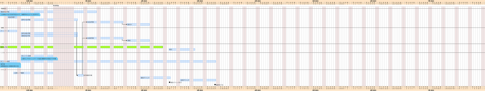

```plantuml
@startgantt
'!include gantt_style.puml
skinparam shadowing false
language ja
saturday are closed
sunday are closed
2022/12/29 to 2023/01/08 is closed
2022/12/29 to 2023/01/08 are named [年末年始]

2022/12/29 to 2023/01/08 is closed

'printscale weekly
today is colored in #AAF

<style>
ganttDiagram {

    task {
        FontColor #343A40
        FontSize 12
            BackGroundColor #338CF733
        LineColor 338CF7
    }
    milestone {
        FontColor #343A40
        FontSize 12
    }
    note {
        FontColor #343A40
        FontSize 12
        BackgroundColor #73CBF3
        LineColor #50BEF0
    }
    timeline {
        BackgroundColor Bisque
    }
}
</style>

Project starts 2022-12-01
-- 電装BOX --
[電装部品手配] starts 2022-12-01
[電装部品手配] lasts 30 days
note bottom
12/8時点では1月末予定なので、納期早めるように交渉する
end note

[板金見積り] starts 2022-12-05
[板金見積り] lasts 5 days
[試作(1台)手配] starts 2022-12-12
[試作(1台)手配] lasts 15 days
[60台手配] starts 2023-01-15
[60台手配] lasts 15 days


[組付け] starts 2023-02-06
[組付け] lasts 10 days

[60台手配] -> [組付け]

'note bottom
'SQLite
'40k record/s
'end note

-- 基板 --
[アートワーク] starts 2022-12-01
[アートワーク] lasts 7 days

[試作(5枚)手配] starts 2022-12-12
[試作(5枚)手配] lasts 15 days

[基板部品手配] starts 2022-12-12
[基板部品手配] lasts 15 days

[60枚手配] starts 2023-01-15
[60枚手配] lasts 15 days

[実装] starts 2023-02-06
[実装] lasts 10 days

[60枚手配] -> [実装]

'[HID検証] -> [HID実装]
'[HID実装] pause on 2021-10-08
'[HID実装] pause on 2021-10-11
'[HID実装] pause on 2021-10-12
'[HID実装] pause on 2021-10-13
'['HID実装] lasts 7 days

-- メカ --
[設計&手配]  starts 2022-12-01
[設計&手配] lasts 55 days
[設計&手配] is colored in GreenYellow/Green

[組立] starts 2023-02-28
[組立] lasts 10 days


-- ソフト --
[PICソフト改修] starts 2022-12-12
[PICソフト改修] lasts 13 days
note bottom
人感センサのインジケータ追加 期間中の何処かで作業
end note

[PCソフト改修] starts 2022-12-01
[PCソフト改修] ends 2023-03-24
note bottom
仮予定
給餌機追加と画像処理を含む
end note

-- デバック --

[人感センサ確認] starts 2022-12-08
[人感センサ確認] lasts 15 days

[試作確認作業] starts 2023-01-11
[試作確認作業] lasts 3 days

[試作(5枚)手配] -> [試作確認作業]
[試作(1台)手配] -> [試作確認作業]
[基板部品手配] -> [試作確認作業]

[試作確認作業] -> [60枚手配]
[試作確認作業] -> [60台手配]

[電気デバック] starts 2023-02-11
[電気デバック] lasts 12 days


[全体デバック] starts 2023-03-06
[全体デバック] lasts 15 days


[電気デバック完了] happens 2023-02-28
[最終完了日] happens 2023-03-24
@endgantt
```
