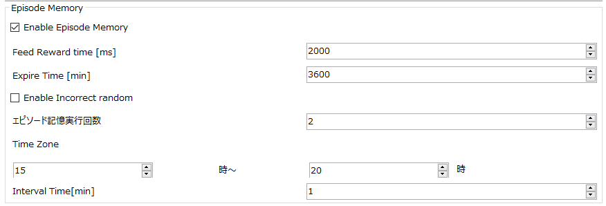

## エピソード記憶設定画面
- エピソード記憶に関する設定画面です。Operationタブページより選択します。
1. Enable Episode Memory
	エピソード記憶を有効にします。
1. Feed Reward time
	リワードのFeed時間を設定します。
1. Expire Time
	登録IDが初期化される時間を選択します。
1. Enable Incorrect random
	設定を行う画面へ移動します。
1. エピソード記憶実行回数
範囲時間に実行する回数を設定します。
1. Time Zone
エピソード記憶実行時間範囲を選択します。

1. Interval Time
エピソード記憶インターバル時間を設定します。
