<!--- pandoc report.md -s -o manual.pdf --pdf-engine=lualatex -V documentclass=ltjsarticle -V luatexjapresetoptions=yu-win -N  --->

* コンパートメント・ソフト説明書
* 2.0.1.1版

|版	|作成日	|作成者	|備考|
|:-|:-:|:-:|:-:|
|1.0	|2021/03/30	|小野	|新規作成|
|1.3	|2021/07/26	|小玉|追加機能 ランダム時間 ドア無効 レバー強制出し|
|1.4	|2021/08/26	|小玉|追加機能 形状ランダム 色ランダム トレーニングEasy etc|
|1.5	|2021/09/07	|小玉|追加機能 Imageランダム リワードタイミング 異常退室再開|
|1.51	|2021/09/22	|小玉|表記修正 |
|1.52	|2021/10/21	|小玉|Step制限項目追加 |
|2.0	|2021/12/29	|小玉|追加機能 Blockプログラムエンジン|
|2.0.1.1|2022/08/31	|小玉|追加機能 Episode Memory		|
:改訂履歴

\clearpage

# 概要
- 本ドキュメントは、コンパートメント・ソフトの説明書です。

# 実行環境
- 本ソフトの実行環境

## OS
- Windows10 Professional 64bit

## ディスプレイ

### メイン・ディスプレイ仕様

- メイン・ディスプレイは下記の仕様のものを使用して下さい。
解像度：フルHD(1920*1080)

### マルチ・ディスプレイ設定
- 本ソフトは、OSのマルチ・ディスプレイ設定において、下記の設定をしておく必要があります。
- 設定方法は、「コンパートメントソフト・インストール手順書」の「タッチ・パネルをPCへ接続、設定」の「Windowsでのマルチディスプレイ設定」を参照して下さい。

1. メイン・ディスプレイ
    - 本ソフトのユーザ・インターフェース画面を表示するディスプレイをメイン・ディスプレイに設定
1. サブ・ディスプレイ
   - タッチ・パネルをサブ・ディスプレイに設定

## フォルダ構成
<pre>
C:\\Compartment\\				本ソフト、関連データを格納したフォルダ
 | 	Compartment.exe				本ソフトの実行ファイル
 |	Compartment.exe.config		本ソフトのコンフィギュレーション・ファイル
 |	MccDaq.dll					DIOボードのライブラリ・ファイル
 |	MccDaq.xml					DIOボード関連ファイル
 |---CompartmentDat\			本ソフトの関連データを格納するフォルダ
 |	preference.xml			本ソフトの設定を格納するファイル
	|	result.csv					本ソフトの結果出力ファイル
	|	EndSound.wav			終了音ファイル(テスト用サンプル・ファイル)
	|	FeedSound.wav			報酬音ファイル(テスト用サンプル・ファイル)
	|	TriggerImage.bmp			トリガ画面画像(BMP)ファイル(テスト用サンプル・ファイル)
	|	TriggerImage.gif			トリガ画面画像(GIF)ファイル(テスト用サンプル・ファイル)
	|	TriggerImage.jpg			トリガ画面画像(JPG)ファイル(テスト用サンプル・ファイル)
	|	TriggerImage.png			トリガ画面画像(PNG)ファイル(テスト用サンプル・ファイル)
</pre>

## ソフトの起動前の準備

- 本ソフトの起動前にPCと機器の接続(下記)を確認し、制御ボックスの電源をONします。
1. 制御ボックスとPCのUSB接続
	- 制御ボックスのIndividualUSBポートとPCをUSBケーブルで接続
	- 制御ボックスのControlUSBポートとPCをUSBケーブルで接続
1. タッチ・パネルとPCの接続
	- タッチ・パネルのUSBポートとPCをUSBケーブルで接続
	- タッチ・パネルのDVI端子とPCのDisplayportをケーブルで接続(使用するPCが変われば、他のディスプレイ・インタフェースを使用する事となります。)
1. 制御ボックスの電源をON

## 初回起動前に行う事

### RFID(ID code)で使用するCOM番号の確認

- COM番号はPCにより異なる可能性があり、PCに合わせて設定する必要があります。
- COM番号の確認方法は、「コンパートメントソフト・インストール手順書」の「機器のPCへの接続、設定」の「制御ボックスのIndividual USBとUSBケーブルでPCへ接続、設定」の「COM番号の確認」を参照し確認し、ここで記録したCOM番号を以降に説明する「ソフトの起動」の「初回起動の設定、動作確認」の「COM番号の設定」において、設定して下さい。

\clearpage

## ソフトの起動

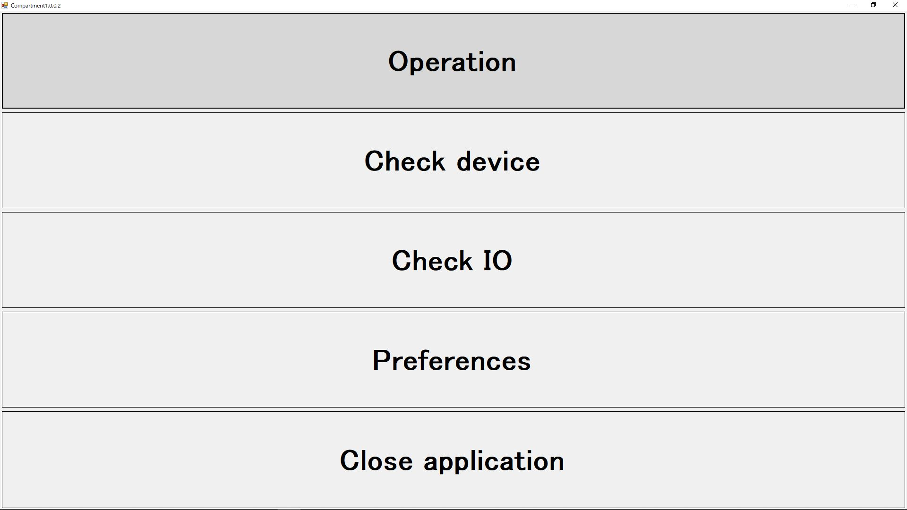

- C:\\Compartment\\Compartment.exeをダブルクリックし、本ソフトを実行します。
- メイン・メニュー画面が表示されます。

## 初回起動時の設定、動作確認

### COM番号の設定

- 初回起動時、RFID(ID code)で使用するCOM番号がデフォルト設定(COM3)となっています。このCOM番号はPCにより異なる可能性があり、PCに合わせて設定する必要があります。
- 上記の「ソフトの起動前の準備」の「初回に起動前に行う事」で記録したCOM番号を設定します。
- 現在設定されているCOM番号がオープンできない時、「COM port open error」が表示されます。この場合にも、同様にCOM番号を設定する必要があります。
- 下記のようにCOM番号を設定して下さい。メイン・メニューの「Preferences」を選択し、「ID codeタブ」を選択し、「COM port」へ使用するCOM番号を設定し、「Doneボタン」を押し、設定を保存し、メイン・メニューへ戻ります。
- COMがオープンできていない場合、メイン・メニューにおいて、「Operation画面」、「Check device画面」、「Check IO画面」へは移動できいません。「Preferences画面」へは移動可能です。

### RFID(ID code)、タッチ・パネルの動作確認
- メイン・メニューからCheckIo画面へ移動し、下記の動作を確認して下さい。
1. RFID(ID code)の読取り確認
	- RFIDのアンテナにRFID(ID code)タグを通し、「ID code」表示領域へRFID(ID code)タグのID codeが表示される事を確認します。
1. タッチ・パネルのタッチ動作確認
	- タッチ・パネルをタッチし、「Touch panel」表示領域へタッチした座標が表示される事を確認します。

# 動作説明

## メイン・メニュー画面
- 起動時に表示するメニュー画面です。行う操作を選択します。
1. Operation
	自動実行を行う画面へ移動します。
1. Check device
	各機器の動作を確認する画面へ移動します。
1. Check IO
	低レベルのポートI/O、機器の動作を確認する画面へ移動します。
1. Block Programming
	ブロックプログラム設定画面を開きます。
1. Preferences
	設定を行う画面へ移動します。
1. Close application
	本ソフトを終了します。

\clearpage

## Operation画面
- 自動実行を行う画面です。

{#fig:sugoi-large height=180mm}

\clearpage

1. ボタン動作
	1. 「Backボタン」
		- Operation画面を終了し、メイン・メニュー画面へ戻ります。
		- 自動実行動作中の場合、「Stopボタン」により自動実行を停止した後、「Backボタン」でメイン・メニュー画面へ戻って下さい。
	1. 「Startボタン」
		- 自動実行を開始します。
	1. 「Stopボタン」
		- 自動実行を中止します。
1. Touch panel
	- タッチ・パネルと同じ画面を表示します。
1. Settingグループ
	- 設定を表示します。
	1. CompartmentNo
		- 設定されているコンパートメント番号を表示します。
	1. Type of task
		- 設定されている課題タイプを表示します。
	1. Number of trial
		- 設定されている試行回数を表示します。
1. Currentグループ
	- 現在のデータを表示します。
	1. Number of trial
		- 現在の試行回数目を表示します。
	1. ID code
		- 現在読み取れたRFIDタグのID codeを表示します。
1. Status
	- 現在の状況を表示します。
	- Re-Entry有効の場合は「再入有効」表示
	- Re-Entry待機中の場合は「再入待機中」表示
	
	### 操作概要

#### 自動実行開始
1. 「Startボタン」を押すと、スタンバイ状態とする為、下記の動作を行います。
    レバー：				引く
    ルーム・ランプ：		OFF
    フィード・ランプ：	OFF
    ドア：				Open
    タッチ・パネル画面：	黒
1. その後、入室待ち状態となります。
1. 以降の動作は、以降に記述の「処理概要」を参照して下さい。

#### 自動実行停止
1. 自動実行中に「Stopボタン」を押すと、自動実行を中止し、スタンバイ状態とする為、下記の動作を行います。
    レバー：				引く
    ルーム・ランプ：		OFF
    フィード・ランプ：	OFF
    ドア：				Open
    タッチ・パネル画面：	黒
1. その後、自動実行開始待ちとなります。

\clearpage

### 処理概要
- 処理概要のフローチャート

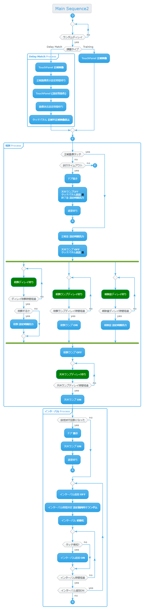{#fig:sugoi-large height=180mm}

{#fig:sugoi-large height=180mm}
別紙 main_flow2.pdf

\clearpage

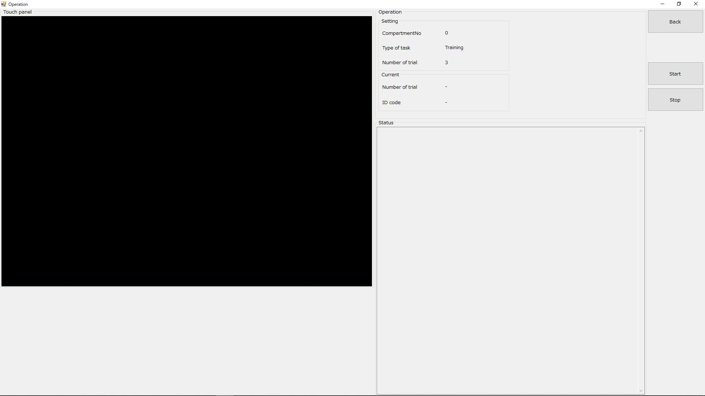

## Check device画面
- 接続機器の動作確認を行う画面です。

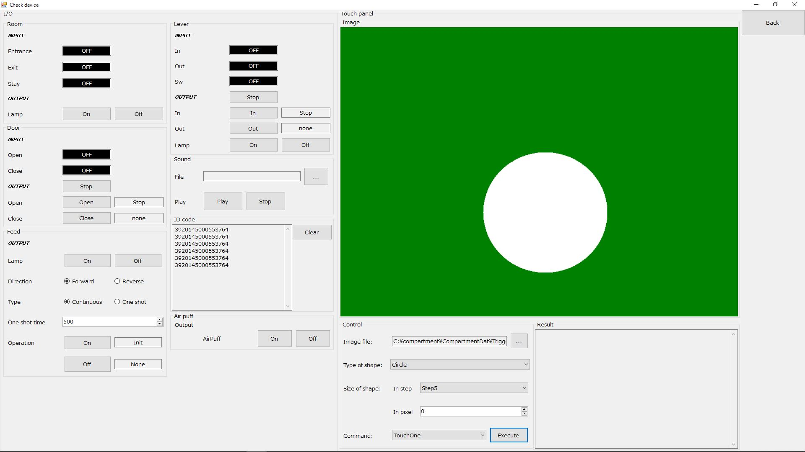

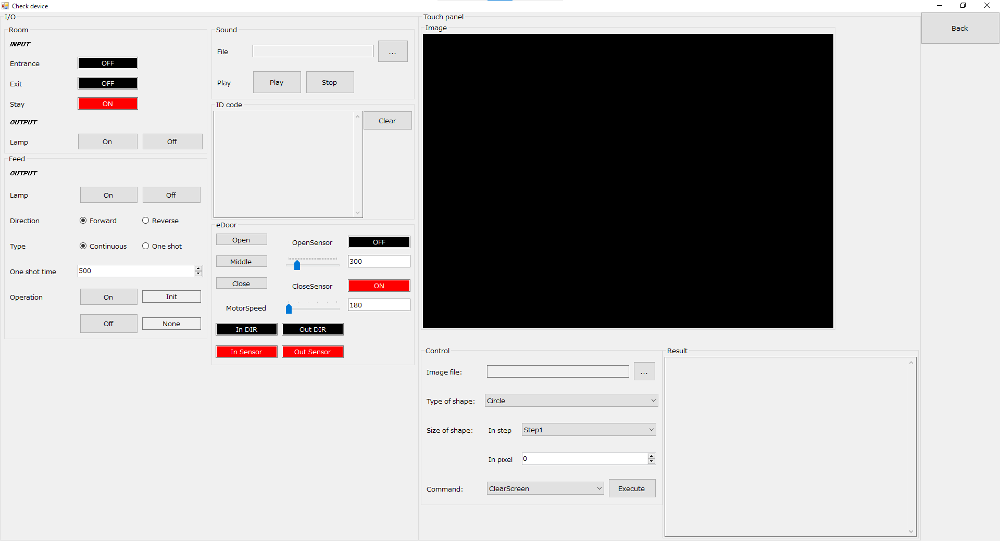

### ボタン動作
1. 「Backボタン」
	- Check device画面を終了し、メイン・メニューへ移動します。

### Roomグループ
1. INPUT
	- Room関連の入力センサの状態を表示します。
		1. Entrance
			- 入室センサの状態を表示します。
		1. Exit
			- 退室センサの状態を表示します。
		1. Stay
			- ルームふるまいセンサの状態を表示します。
1. OUTPUT
	- Room関連の出力機器を動作させます。
		1. Lamp
			- ルーム・ランプをON／OFFします。
			1. 「ONボタン」：		ルーム・ランプをONします。
			1. 「OFFボタン」：	ルーム・ランプをOFFします。

### Doorグループ
1. INPUT
	- ドア関連の入力センサの状態を表示します。
	1. Open
		- ドアOpenセンサの状態を表示します。
	1. Close
		- ドアCloseセンサの状態を表示します。
1. OUTPUT
 - ドア関連の出力機器を動作させます。
	1. 「Openボタン」：	ドアをOpenします。
	1. 「Closeボタン」：	ドアをCloseします。
	1. 「Stopボタン」：	ドア動作を停止します。
	1. ボタン右側の表示
		- ドアを動作させた時の動作状態／結果を表示します。
            1. 上側の表示：	ドアの動作状態を表示します。
		    1. 下側の表示：	ドアの動作結果を表示します。

### Feedグループ
1. OUTPUT
 - フィード関連の出力機器を動作させます。
	1. Lamp
		- フィード・ランプをON／OFFします。
		    1. 「ONボタン」：		フィード・ランプをONします。
		    1. 「OFFボタン」：	フィード・ランプをOFFします。
	1. Direction
		- フィード・ポンプの回転方向を指定します。
		    1. 「Forwardラジオ・ボタン」：	正回転(Forward)を指定します。
		    1. 「Reverseラジオ・ボタン」：	逆回転(Reverse)を指定します。
	1. Type
		- フィードの動作タイプを指定します。
		    1. 「Continuousラジオ・ボタン」：	・連続作動を指定します。
        - 「ONボタン」を押した後、「OFFボタン」を押すまで、フィード・ポンプを回転し続けます。
		    1. 「One shotラジオ・ボタン」：		・時間指定作動を指定します。
    - 「One shot time」で指定した時間数フィード・ポンプを回転した後、停止します。
	1. One shot time [ms]
		- 上記<3>Typeにおいて「One shotラジオボタン」を選択した時、使用されるフィード作動時間です。
		- 設定範囲
			下限値：500[ms]
			上限値：10000[ms]
	1. Operation
		- 上記のフィード関連設定で指定した内容でフィード・ポンプを作動します。
		    1. 「ONボタン」：		フィード・ポンプを作動します。
		    1. 「OFFボタン」：	フィード・ポンプの作動を停止します。
		    1. ボタン右側の表示
	    - フィードを動作させた時の動作状態／結果を表示します。
            1. 上側の表示：	フィードの動作状態を表示します。
			1. 下側の表示：	フィードの動作結果を表示します。

### Leverグループ
1. INPUT
	- レバー関連の入力センサの状態を表示します。
		1. In
			- レバー移動INセンサの状態を表示します。
		1. Out
			- レバー移動OUTセンサの状態を表示します。
		1. Sw
			- レバーSWの状態を表示します。
1. OUTPUT
 	- レバー関連の出力機器を動作させます。
		1. 「Inボタン」：		レバーをInします。(レバーがケージからなくなる方向へ移動します)
		1. 「Outボタン」：	レバーをOutします。(レバーがケージへ出現する方向へ移動します。)
		1. 「Stopボタン」：	レバー動作を停止します。
		1. ボタン右側の表示
			- レバーを動作させた時の動作状態／結果を表示します。
				1. 上側の表示：	レバーの動作状態を表示します。
				1. 下側の表示：	レバーの動作結果を表示します。
	1. Lamp
		- レバー・ランプをON／OFFします。
		    1. 「ONボタン」：		レバー・ランプをONします。
		    1. 「OFFボタン」：	レバー・ランプをOFFします。

### Soundグループ
1. File
	- 再生する音声ファイル(WAV)を指定します。
		1. 「…ボタン」：		音声ファイル選択ダイアログにて、音声ファイルを選択します。
1. 「Play」
	- 上記の「[1]File」で指定した音声ファイルを再生／再生停止します。
		1. 「Playボタン」：	「[1]File」で指定した音声ファイルを再生します。
		1. 「Stopボタン」：	音声ファイルの再生を停止します。

### ID codeグループ
1. ID code表示領域
	- 読み取ったRFID(ID code)タグのID codeを表示します。
1. 「Clearボタン」：	「ID code表示領域」をクリアします。

### Air puffグループ
1. Output
	- エア・パフを動作させます。
	1. 「Onボタン」：	エア・パフをONします。
	1. 「Offボタン」：	エア・パフをOFFします。

### Touch panelグループ
1. Image表示領域
	- タッチ・パネルへ表示する画面と同じ内容を表示します。
1. Controlグループ
	- タッチ・パネル関連の動作を行います。
	1. Image file
		- 表示する画像ファイルを指定します。
			1. 「…ボタン」：	画像ファイル選択ダイアログにて、画像ファイル(JPG／PNG／BMP)を選択します。
	1. Type of shape
		- 表示する図形タイプを指定します。
			1. コンボボックス：	図形タイプを下記の選択項目から選択します。
				1. Circle（円）
				1. Rectangle（正方形）
				1. Triangle（正三角形）
				1. Star（星型）
	1. Size of shape
		- 図形サイズを指定します。
			1. In stepコンボボックス： 図形サイズをStep1～Step5から選択します。
			1. In pixel入力領域：		図形サイズをPixelで指定する場合のPixel数を指定します。
				値==0の時：	上記「(1)In stepコンボボックス」で指定したStepを使用します。
				値!=0の時：	この項目で指定したPixel数を使用します。
				- 図形の外接する円の直径の長さで設定します。
					- 設定範囲
						下限値：0[pixel]
						上限値：250[pixel]

	1. Command
		- タッチ・パネル関連の操作を選択し、実行します。
			1. コンボボックス：	下記の候補からタッチ・パネル操作を選択します。
				1. ClearScreen
				   - タッチ・パネルを黒でクリアします。
				1. DrawBackColor
				   - タッチ・パネルを「Preference画面」で設定されている背景色でクリアします。
				1. DrawImage
				   - 上記<1>Image fileで指定した画像ファイルをタッチ・パネルへ表示します。
				1. TouchAny
				   - タッチ・パネルのどこでもタッチ検知を開始します。
				   - タッチ・パネルのどこをタッチしてもOKと判定します。
				   - Result表示領域へタッチ座標(X,Y)とその結果を表示します。
				1. TouchOne
				   - 指定された図形タイプ、サイズ、ランダム位置で正解図形を表示し、その正解図形領域のタッチ検知を開始します。
				   - 正解図形上でタッチした場合、OKと判定します。
				   - Result表示領域へタッチ座標(X,Y)とその結果を表示します。
				1. TouchTwo
				   - 指定された図形タイプ、サイズ、ランダム位置で正解図形、不正解図形を表示し、正解図形領域のタッチ検知を開始します。
				   - 正解図形上でタッチした場合、OKと判定します。
				   - Result表示領域へタッチ座標(X,Y)とその結果を表示します。
				1. TouchEnd
				   - タッチ検知を終了します。
				   - タッチ検知を行う操作(「TouchAny」、「TouchOne」、TouchTwo」)を終了させる場合、この操作でタッチ検知を終了して下さい。
				   - タッチ検知を行う操作(「TouchAny」、「TouchOne」、TouchTwo」)を続けて実行する場合は、この操作は実行する必要はありません。
			1. 「Executeボタン」：	上記のコンボボックスで選択した操作を実行します。
1. Result表示領域
	- タッチ・パネルへのタッチ結果を表示します。
	- 具体的には、「Command」において、「TouchAny」、「TouchOne」、「TouchTwo」を実行した時、タッチ座標(X,Y)とその結果を表示します。

## Check IO画面
- IOポート、RFID(ID code)、タッチ・パネルの下位レベルの動作を確認を行う画面です。

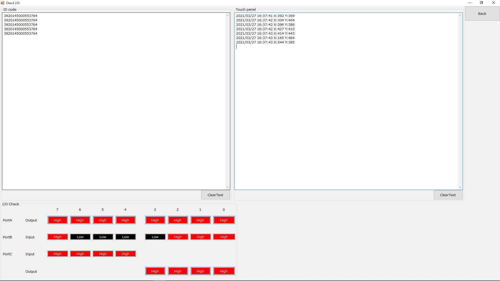

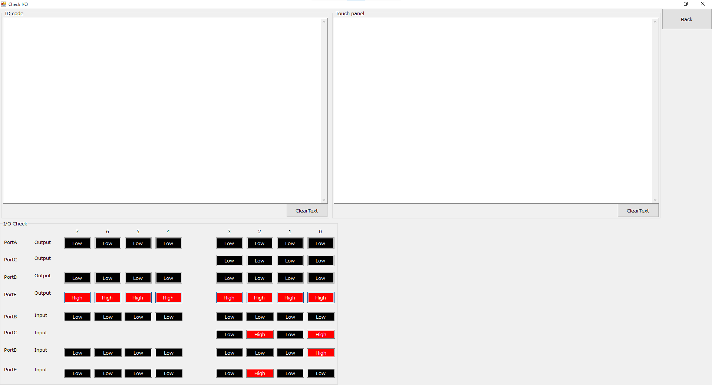

### ボタン動作
1. 「Backボタン」
	- Check IO画面を終了し、メイン・メニューへ移動します。

### ID codeグループ
1. ID code表示領域
	- RFID(ID code)タグをアンテナに通した時、読み取ったID codeを表示します。
1. 「Clear textボタン」
	- ID code表示領域をクリアします。

### Touch panelグループ
1. Touch panel表示領域
	- タッチ・パネルをタッチした時、そのタイムスタンプ、タッチ座標(X,Y)を表示します。
1. 「Clear textボタン」
	- Touch panel表示領域をクリアします。

### I/O Checkグループ
 - 機器の故障等があった時、I/Oポートを直接操作するものです。出力ポートに関しては、複数ビットとの組み合わせで制御する機器もある為、操作しないようにして下さい。
 - 入力ポートに接続されているセンサ等のON／OFFの状態を確認する事ができます。
	1. ポートの入出力方向
		- PortA：			出力ポート
		- PortB：			入力ポート
		- PortC（上位側）：	入力ポート（未使用）
		- PortC（下位側）：	出力ポート
	1. 出力ポート
		- Lowアクティブですので、Lowとした時、ONの意味となります。
		- 各ビットがボタンとなっており、ボタンを押す事により、ポートをHigh／Low出力できます。
	1. 入力ポート
		- Lowアクティブですので、Lowとした時、ONの意味となります。
		- 現在の入力ポートの状態をHigh／Lowで表示します。

### ポートに対する機器

|ポート名	|入出力	|ビット番号	|機器|
|---------:|:-----:|:--------:|:--:|
|PortA	|出力|	7|	フィード・ランプ|
|	    |出力|	6|	ルーム・ランプ|
|	    |出力|	5|	レバーOUT|
|	    |出力|	4|	レバーIN|
|	    |出力|	3|	フィード正回転(Forward)|
|	    |出力|	2|	フィード逆回転(Reverse)|
|	    |出力|	1|	ドアClose|
|	    |出力|	0|	ドアOpen|
|PortB	|入力|	7|	レバーSWセンサ|
|	    |入力|	6|	レバーOUTセンサ|
|	    |入力|	5|	レバーINセンサ|
|	    |入力|	4|	ドアOpenセンサ|
|	    |入力|	3|	ドアCloseセンサ|
|	    |入力|	2|	入室センサ(ケージに近い側)|
|	    |入力|	1|	退室センサ(ケージから遠い側)|
|	    |入力|	0|	ルームふるまいセンサ|
|PortC(下位側)	|出力|	3|	未使用|
|	|出力|	2|	未使用|
|	|出力|	1|	エア・パフ|
|	|出力|	0|	レバー・ランプ|

:ポート表

\clearpage

### A-Cage ポートに対する機器

|ポート名	|入出力	|ビット番号	|機器|
|---------:|:-----:|:--------:|:--:|
|PortIn0	|入力|	7|	レバーSWセンサ|
|	    |入力|	6|	レバーOUTセンサ|
|	    |入力|	5|	FeedMotorCCWスイッチ|
|	    |入力|	4|	FeedMotorCWスイッチ|
|	    |入力|	3|	Feedセンサ|
|	    |入力|	2|	ルームふるまいセンサ|
|	    |入力|	1|	入室センサ(ケージに近い側)|
|	    |入力|	0|	退室センサ(ケージから遠い側)|
|PortIn2	|入力|	7|	-|
|	    |入力|	6|	-|
|	    |入力|	5|	-|
|	    |入力|	4|	-|
|	    |入力|	3|	Conveyor timeoverError|
|	    |入力|	2|	Conveyorbusy|
|	    |入力|	1|	MarmosetTimeoverError|
|	    |入力|	0|	MarmosetReady|
|PortIn4	|入力|	7|	-|
|	    |入力|	6|	detect Out Direction|
|	    |入力|	5|	detect In Direction|
|	    |入力|	4|	ExfeederError|
|	    |入力|	3|	eDoor motorCCWLIM|
|	    |入力|	2|	eDoor motorCWLIM|
|	    |入力|	1|	eDoor insideセンサ|
|	    |入力|	0|	eDoor outsideセンサ|
|PortOut0	|出力|	7|	-|
|	    |出力|	6|	-|
|	    |出力|	5|	-|
|	    |出力|	4|	Feed conveyor|
|	    |出力|	3|	ルーム・ランプ|
|	    |出力|	2|	フィード・ランプ|
|	    |出力|	1|	フィード逆回転(Reverse)|
|	    |出力|	0|	フィード正回転(Forward)|
|PortOut2	|出力|	7|	-|
|	    |出力|	6|	-|
|	    |出力|	5|	-|
|	    |出力|	4|	-|
|	    |出力|	3|	-|
|	    |出力|	2|	Conveyor Start|
|	    |出力|	1|	-|
|	    |出力|	0|	Start flag|
|PortOut4	|出力|	7|	-|
|	    |出力|	6|	-|
|	    |出力|	5|	-|
|	    |出力|	4|	-|
|	    |出力|	3|	Exfeeder start|
|	    |出力|	2|	-|
|	    |出力|	1|	eDoor Reverse|
|	    |出力|	0|	eDoor Forward|
|PortOut6	|出力|	7|	eDoor motor speed bit7|
|	    |出力|	6|	eDoor motor speed bit6|
|	    |出力|	5|	eDoor motor speed bit5|
|	    |出力|	4|	eDoor motor speed bit4|
|	    |出力|	3|	eDoor motor speed bit3|
|	    |出力|	2|	eDoor motor speed bit2|
|	    |出力|	1|	eDoor motor speed bit1|
|	    |出力|	0|	eDoor motor speed bit0|

:A-Cageポート表

## BlockProgramming画面
- BlockProgramming構成を設定する画面です。

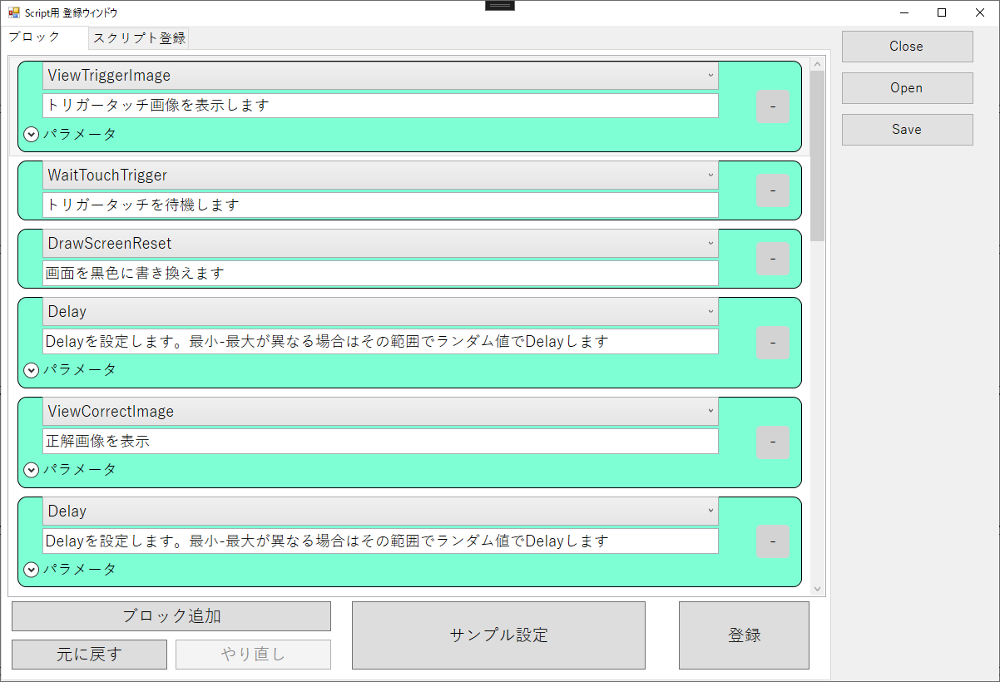

## Preferences画面
- 設定を行う画面です。
- 設定はカテゴリ毎にタブに分かれており、タブを選択し、各カテゴリの設定を行います。

### ボタンの動作
1. 「Doneボタン」(右一番上のボタン)
	・設定を保存し、メイン・メニューへ移動します。
1. 「Cancelボタン」(右上から二番目のボタン)
	・設定を保存せず、メイン・メニューへ移動します。

### Compartmentタブ
- コンパートメント関連の設定を行います。

1. Compartmentグループの設定項目
    1. Compartment No
	- コンパートメントに割り当てる識別用の番号を設定します。
		- 設定範囲
			下限値：0
			上限値：99999

### ID codeタブ
- RFID(ID code)関連の設定を行います。

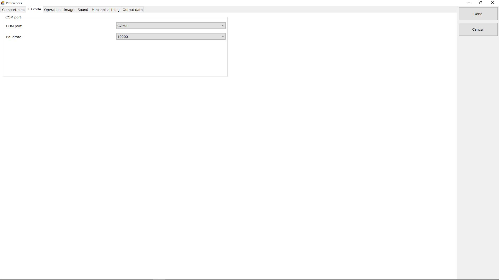

- COM portグループの設定項目
	- RFID(ID code)デコード・ボードとの通信の設定をします。
	1. COM port
		- 使用するCOM番号を設定します。
		- 現在認識されているポートから選択します。
	1. Baudrate
		- 使用する通信速度を設定します。
		- 初期設定：19200[bps]のままで使用します。（変更しないで下さい）

### Operationタブ
- 試行、課題、Feed関連の設定を行います。

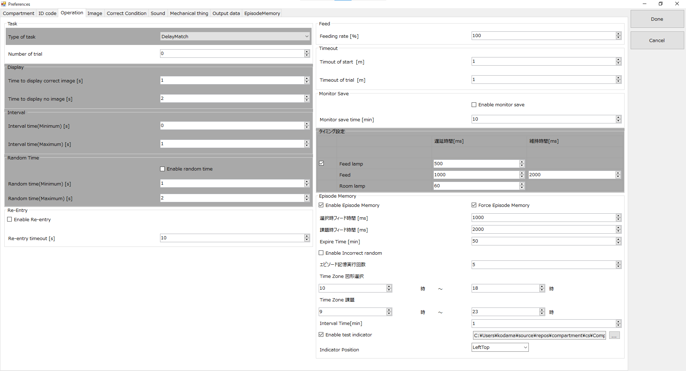

1. Task（課題）グループの設定項目
	1. Type of task
		- 課題タイプを設定します。
		- 下記の項目から選択します。
			1. Training（訓練）:訓練課題実施
			1. DelayMatch（デイレイマッチ）：ディレイマッチ課題実施
			1. TrainingEasy（簡単訓練）：トリガ画像タッチで成功報酬
			1. UnConditionalFeeding （無条件給餌）：入室のみで成功報酬
	1. Number of trial
		- 試行回数（課題の正解回数）を設定します。
		- ≧1の時、有限回の試行設定となり、正解回数がこの回数となった時、課題実行を終了します。
		- ＝0の時、無限回の試行設定となります。動作を停止するまで試行を繰り返します。
		- 設定範囲
			下限値：0
			上限値：10000
1. Display（表示）グループの設定項目
	1. Time to display correct image [s]
		- DelayMatchにおける正解図形の表示時間を設定します。
		- 設定範囲
			下限値：0[s]
			上限値：300[s]
	1. Time to display no image [s]
		- DelayMatchにおける正解図形表示後の消去時間（設定背景色の表示時間）を設定します。
		- 設定範囲
			下限値：0[s]
			上限値：300[s]
1. Interval（インターバル）グループの設定項目
	1. Interval time(Minimum) [s]
		- 課題正解後、次回トリガ画像表示までの時間の最小値を設定します。
		　インターバルはランダムに決定し、その乱数の下限値
		- 設定範囲
			下限値：0[s]
			上限値：300[s]
	1. Interval time(Maximum) [s]
		- 課題正解後、次回トリガ画像表示までの時間の最大値を設定します。
		　インターバルはランダムに決定し、その乱数の上限値
		- 設定範囲
			下限値：0[s]
			上限値：300[s]
1. Random Timeグループの設定項目
	1. Enable random time
		- ディレイマッチ後指定時間間のランダム時間待機を有効にします。
		
	1. Interval time(Minimum) [s]
		- ディレイマッチ後指定時間間のランダム時間待機の最小値を設定します。
		
	1. Interval time(Maximum) [s]
		- ディレイマッチ後指定時間間のランダム時間待機の最大値を設定します。

1. Re-Entryグループの設定項目
	1. Enable Re-Entry
		- 途中退室時、同じ状況から再開する機能を提供します。
	1. Re-entry timeout
		- 途中退室待機を終了する時間を指定します。

1. Feed（給餌）グループの設定項目
	1. Feeding rate [%]
		- 課題正解後、給餌する確率を設定します。
			1. 試行回数設定==0の時（試行回数無限回設定の時）
				課題正解毎に乱数を生成し、給餌確率に従った比率で給餌します。
			1. 試行回数設定≧1の時（試行回数有限回設定の時）
			    試行回数設定＊給餌確率／100の計算結果を小数点以下切り捨てした回数を給餌回数とします。
			    試行回数設定となり終了した時、この給餌回数となるようにランダムに各試行回に対して、
			    給餌をスケジューリングします。
		- 設定範囲
			下限値：0[%]
			上限値：100[%]
	1. Time to feed [ms]
		- 給餌時に給餌ポンプを作動させる時間を設定します。
		- 設定範囲
			下限値：0[ms]
			上限値：60000[ms]
1. Timeoutグループの設定項目
	1. Timeout of start [m]
		- 開始（入室検知からレバーSWをONするまで）のタイムアウト時間を設定します。
		- 設定範囲
			下限値：1[m]
			上限値：60[m]
	1. Timeout of trial [m]
		- 課題のタイムアウト時間を設定します。
		- 設定範囲
			下限値：1[m]
			上限値：60[m]

1. Monitor Saveグループの設定項目
	1. Enable monitor save
		- モニターセーブ機能を有効にします。待機時、設定時間が経過するとモニターセーブになり入室があると復帰します。
	1. Monitor save time[min]
		- モニターセーブになるまでの時間を設定をします。
			下限値：1[min]
			上限値：1000[min]
1. タイミング設定

	|Enable|項目|遅延時間|維持時間|
	|---------:|:-----:|:--------:|:--:|
	|		|	|		|		|
	| Feed Lanp Enable | Feed Lamp | Feed lamp遅延時間 |	|
	|		| Feed | Feed遅延時間 | Feed継続時間 |
	|		| Room Lamp | RoomLamp遅延時間|		|

1. Episode Memory
	1. Enable Episode Memory
		- エピソード記憶機能を有効にします。
	1. Force Episode Memory
		- 条件にかかわらず強制ですべての課題をエピソード記憶課題にします。
	1. 選択時フィード時間[ms]
		- 図形選択時のフィード時間を設定します。
	1. 課題時フィード時間[ms]
		- エピソード課題正解時のフィード時間を設定します。
	1. ExpireTime[min]
		- 選択ターゲット有効期限を設定します。期限が経過すると選択画面が表示されます。
	1. Enable Incorrect Random
		- 不正解ターゲットをランダムとします。
	1. エピソード記憶実行回数
		- エピソード課題を実行する回数を設定します。回数経過後通常課題に戻ります。
	1. Timezone 図形選択
		- 図形選択を行わせる時間を設定します。
	1. Timezone 課題
		- エピソード課題を行わせる時間を設定します。
	1. Interval Time[min]
		- 次のエピソード課題を表示するインターバルを設定します。
	1. Enable test indicator
		- 課題時に表示するインジケーター図形ファイルを設定します。
	1. Indicator Position
		- インジケーター図形を表示する位置を指定します。

### Imageタブ
 - 画像、画面表示、図形関連の設定を行います。

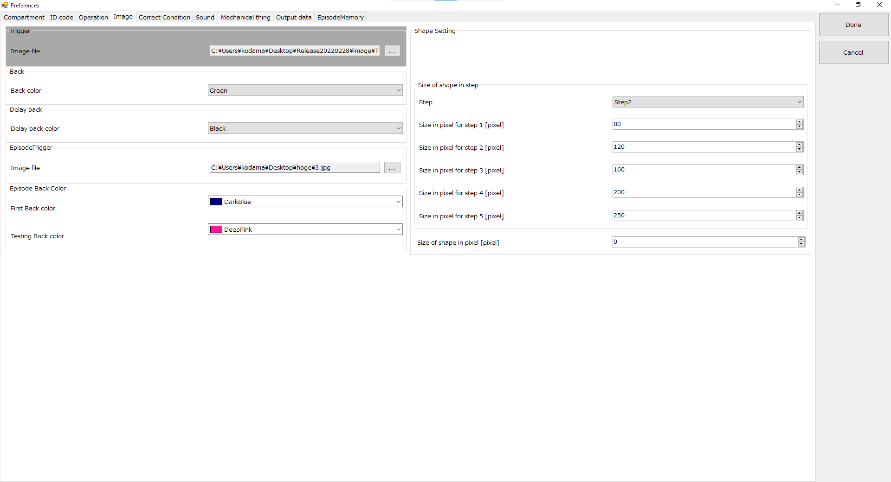

1. Tigger（トリガ画面）グループの設定項目
	1. Image file
		- 課題開始前のトリガ画面に表示する画像ファイル(JPG／PNG／BMP)を設定します。
		- 初期値：C:\\Compartment\\CompartmentDat\\TriggerImage.JPG
1. Back（背景）グループの設定項目
	1. Back color
		- タッチ・パネルの背景色を設定します。
		- 下記の色から選択します。
			1. Black（黒）
			1. White（白）
			1. Red（赤）
			1. Green（緑）
			1. Blue（青）
			1. Yellow（黄）
1. Delay Back
	1. Delay back color
		- ディレイ時の背景色を設定します。
1. EpisodeTrigger
	1. Image file
		- エピソード記憶時のTrigger画像を指定します。
1. Episode Back Color
	1. First Back color
		- エピソード記憶 図形選択時の背景色を指定します。
	1. Testing Back color
		- エピソード課題時の背景色を指定します。
1. Shape（図形）グループの設定項目
	1. Shape color
		- 課題時に表示する図形の色を設定します。
		- 下記の色から選択します。
			1. Black（黒）
			1. White（白）
			1. Red（赤）
			1. Green（緑）
			1. Blue（青）
			1. Yellow（黄）
	1. Type of shape
		- 課題時に表示する図形タイプを設定します。
		- 下記の図形タイプから選択します。
			1. Circle（円）
			1. Rectangle（正方形）
			1. Triangle（正三角形）
			1. Star（星型）
1. Size of shape（図形サイズ）グループの設定項目
	1. Step
		- 課題で表示する図形の大きさを段階（Step）で設定します。
		- 下記の段階（Step）から選択します。
			1. Step1（小さい）
			1. Step2
			1. Step3
			1. Step4
			1. Step5（大きい）
	1. Size in pixel for step1 [pixel]
		- 図形の大きさの段階1（Step1）に対するサイズ（pixel数）を設定します。
		- 図形の外接する円の直径の長さで設定します。
		- 設定範囲
			下限値：80[pixel]
			上限値：250[pixel]
	1. Size in pixel for step2 [pixel]
		- 図形の大きさの段階2（Step2）に対するサイズ（pixel数）を設定します。
		- 図形の外接する円の直径の長さで設定します。
		- 設定範囲
			下限値：80[pixel]
			上限値：250[pixel]
	1. Size in pixel for step3 [pixel]
		- 図形の大きさの段階3（Step3）に対するサイズ（pixel数）を設定します。
		- 図形の外接する円の直径の長さで設定します。
		- 設定範囲
			下限値：80[pixel]
			上限値：250[pixel]
	1. Size in pixel for step4 [pixel]
		- 図形の大きさの段階4（Step4）に対するサイズ（pixel数）を設定します。
		- 図形の外接する円の直径の長さで設定します。
		- 設定範囲
			下限値：80[pixel]
			上限値：250[pixel]
	1. Size in pixel for step5 [pixel]
		- 図形の大きさの段階5（Step5）に対するサイズ（pixel数）を設定します。
		- 設定範囲
			下限値：80[pixel]
			上限値：250[pixel]
	1. Size of shape in pixel [pixel]
		- 課題に表示する図形の大きさを直接pixel数で設定します。
        - 図形の外接する円の直径の長さで設定します。
		- この項目の設定値==0の時、上記設定項目：「[1]Step」の設定（段階指定のサイズ設定）を使用します。
		- この項目の設定値!=0の時、この設定項目の値（pixel指定のサイズ設定）を使用します。
		- 設定範囲
			下限値：0[pixel]
			上限値：250[pixel]

### CorrectConditionタブ
 - 正解条件の設定を行います。

 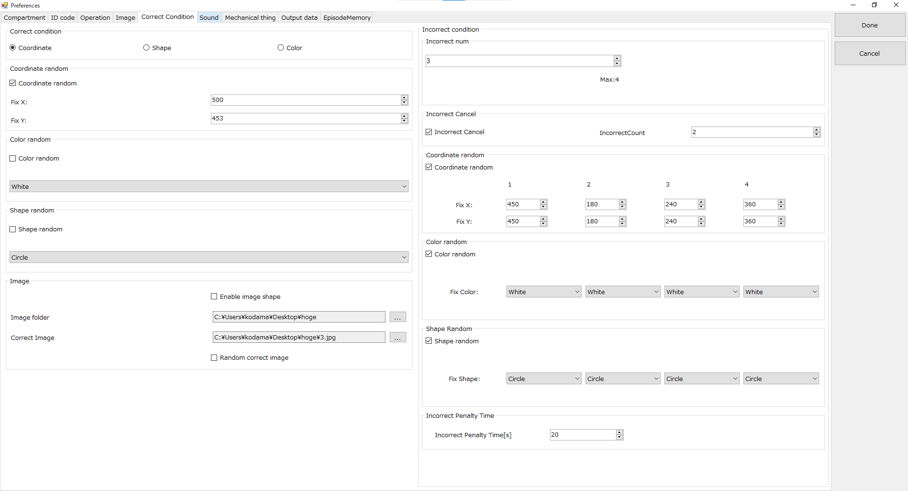

 1. 正答条件項目
	1. Correct Condition
		1. Coordinate
			- 座標
		1. Shape
			- 形状
		1. Color
			- 色
	1. Coordiante random
		1. Coordinate random
			- 正答座標値ランダム 検査毎に正答座標値をランダムに設定します。
		1. Fix X
			- 正答座標値固定X
		1. Fix y
			- 正答座標値固定Y
	1. Color random
		1. Color random
			- 正答色ランダム  検査毎に正答色をランダムに設定します。
		1. Fix color
			- 正答色固定
	1. Shape random
		1. Shape random
			- 正答形状ランダム  検査毎に正答形状をランダムに設定します。
		1. Fix shape
			- 正答形状固定
	1. Image
		1. Enable image shape
			- 画像による正答判別
		1. Image Folder
			- 画像ファイル指定フォルダ
		1. Correct Image
			- 固定正答画像ファイル
		1. Random correct image
			- 正答画像ランダム
	1. Incorrect condition
		- 不正解条件
		1. Incorrect Num
			- 不正解ターゲット数
		1. Incorrect cancel
			1. Incorrect Cancel
				- 連続不正解で課題中止
			1. IncorrectCount
				- 不正解許容回数
		1. Coordinate random
			- 不正解座標ランダム条件
			1. Coordinate random
			1. Fix X
				- 1個目条件X
				- 2個目条件X
				- 3個目条件X
				- 4個目条件X
			1. Fix Y
				- 1個目条件Y
				- 2個目条件Y
				- 3個目条件Y
				- 4個目条件Y
		1. Color random
			- 不正解色ランダム条件
			1. Color Random
			1. Fix Color
				- 1個目条件色
				- 2個目条件色
				- 3個目条件色
				- 4個目条件色
		1. Shape random
			- 不正解形状ランダム条件
			1. Shape random
			1. Fix Shape
				- 1個目条件形状
				- 2個目条件形状
				- 3個目条件形状
				- 4個目条件形状
		1. Incorrect Panelty Time
			1. IncorrectPenalty Time[s]
				- 不正解時ペナルティ時間を追加する。ペナルティ時間経過後課題を再開。経過時間は画面に表示される。

### Soundタブ
 - 音再生関連の設定を行います。

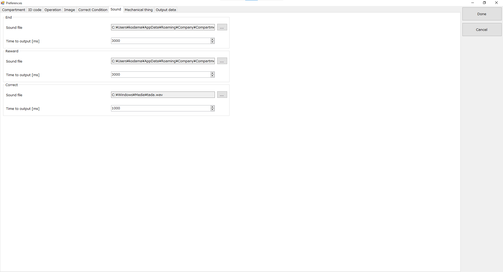

1. End(終了)グループの設定項目
	1. Sound file
		- 終了音（退室を促す音）の音声ファイル(WAV)を設定します。
		- 初期値：C:\\Compartment\\CompartmentDat\\EndSound.wav
	1. Time to output [ms]
		- 終了音の再生時間を設定します。
		- 設定範囲
			下限値：500[ms]
			上限値：10000[ms]
1. Reward(報酬)グループの設定項目
	1. Sound file
		- 報酬音の音声ファイル(WAV)を設定します。
		- 初期値：C:\\Compartment\\CompartmentDat\\FeedSound.wav
	1. Time to output [ms]
		- 報酬音の再生時間を設定します。
		- 設定範囲
			下限値：500[ms]
			上限値：10000[ms]
1. Correct(正解)グループの設定項目
	1. Sound file
		- 正解時の音声ファイル(WAV)を設定します。
	1. Time to output [ms]
		- 正解音の再生時間を設定します。
		- 設定範囲
			下限値：500[ms]
			上限値：10000[ms]

### Mechanical thingタブ
 - 機構機器関連の設定を行います。

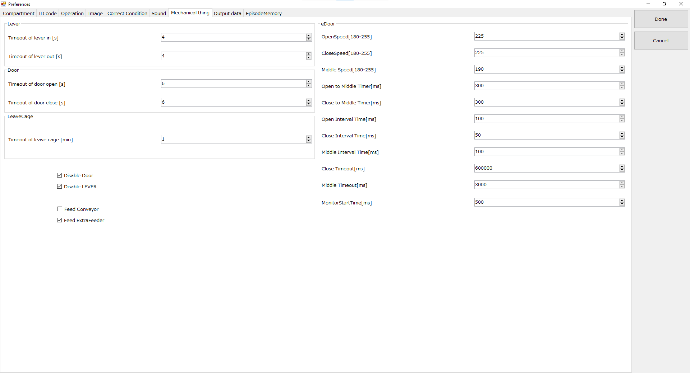

1. Lever(レバー)グループの設定項目
	1. Timeout of lever in [s]
		- レバーがケージ内から外へ移動する時のタイムアウト時間を設定します。
		- 初期値：4[s]のまま使用します。(変更しないで下さい)
		- 設定範囲
			下限値：4[s]
			上限値：10[s]
	1. Timeout of lever out[s]
		- レバーがケージ外から内へ移動する時のタイムアウト時間を設定します。
		- 初期値：4[s]のまま使用します。(変更しないで下さい)
		- 設定範囲
			下限値：4[s]
			上限値：10[s]
1. Door(ドア)グループの設定項目
	1. Timeout of door open [s]
		- ドアをオープンする時のタイムアウト時間を設定します。
		- 初期値：6[s]のまま使用します。(変更しないで下さい)
		- 設定範囲
			下限値：6[s]
			上限値：10[s]
	1. Timeout of door close[s]
		- ドアをクローズする時のタイムアウト時間を設定します。
		- 初期値：6[s]のまま使用します。(変更しないで下さい)
		- 設定範囲
			下限値：6[s]
			上限値：10[s]
1. LeaveCageグループの設定項目
	1. Timeout of leave cage[min]
		- ケージ退出のタイムアウト時間を設定します。
		- 設定範囲
			下限値：1[min]
			上限値：60[min]

1. Disable Door
	- ドア機能を無効にします。
1. Force out LEVER
	- 強制的にレバーを出します。
1. Feed Conveyor
	- コンベアフィーダーを使用します。
1. Feed ExtraFeeder
	- 追加フィーダーを使用します。

1. eDoorグループの設定項目
	- 今後本実装

### Output data
 - 結果を出力するファイル関連の設定を行います。

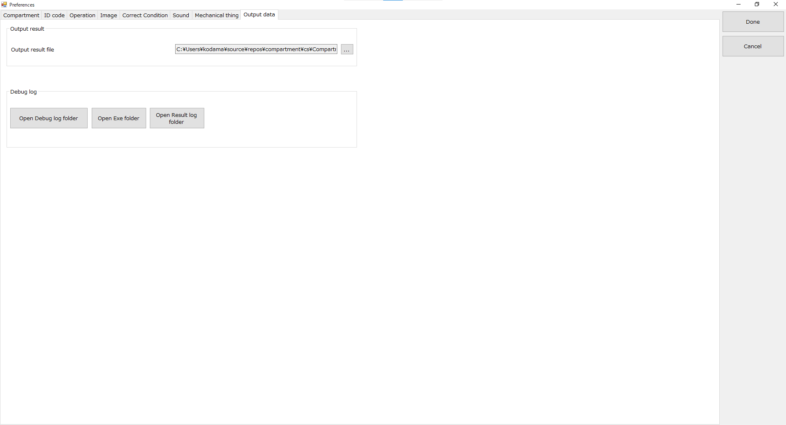

1. Output dataグループの設定項目
	1. Ouput result file
		- 結果を出力するファイルを設定します。
		- 存在しないファイル名を入力することにより新規ファイルが作成されます。
		- 初期値：C:\\Compartment\\CompartmentDat\\result.csv

1. Debug logグループ
	- デバッグに有用なボタン群です。
	1. Open Debug log folder
		- デバッグログが保存されたフォルダを開きます。
		- 保存位置 %APPDATA%\\Compartment\\%VERSION%\\logFile.txt (バージョンによって位置が異なります)
	1. Open Exe folder
		- 実行ファイルのフォルダを開きます。
	1. Open Result log folder
		- 現在のresult.csvが保存されているフォルダを開きます。
## EpisodeMemory
 - エピソード記憶に関連する設定を行います。

 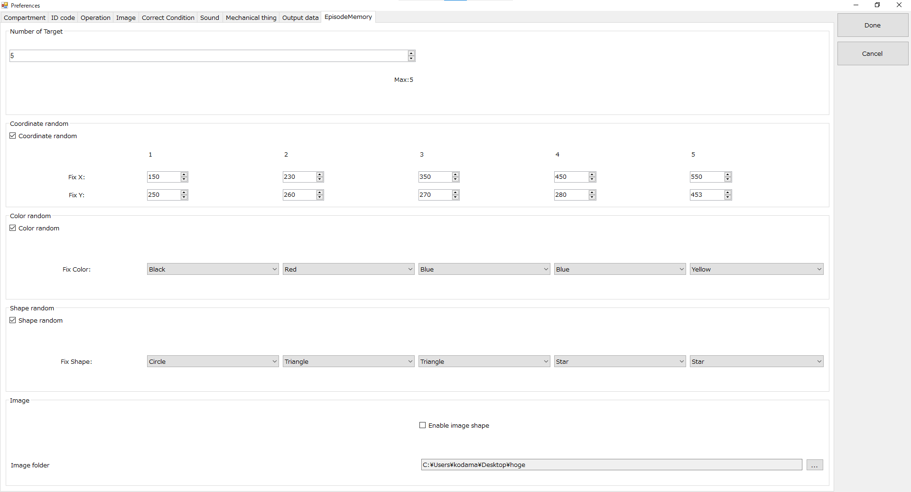
 
 1. Number of Target
 1. Coordiante random
	1. Coordinate random
		- 座標値ランダム 検査毎に正答座標値をランダムに設定します。
	1. Fix X 1
		- Target1座標値固定X
	1. Fix y 1
		- Target1座標値固定Y
	1. Fix X 2
		- Target2座標値固定X
	1. Fix y 2
		- Target2座標値固定Y
	1. Fix X 3
		- Target3座標値固定X
	1. Fix y 3
		- Target3座標値固定Y
	1. Fix X 4
		- Target4座標値固定X
	1. Fix y 4
		- Target4座標値固定Y
	1. Fix X 5
		- Target5座標値固定X
	1. Fix y 5
		- Target5座標値固定Y
 1. Color random
	1. Color random
		- 正答色ランダム  検査毎に正答色をランダムに設定します。
	1. Fix color 1
		- Target1色固定X
	1. Fix color 1
		- Target1色固定Y
	1. Fix color 2
		- Target2色固定X
	1. Fix color 2
		- Target2色固定Y
	1. Fix color 3
		- Target3色固定X
	1. Fix color 3
		- Target3色固定Y
	1. Fix color 4
		- Target4色固定X
	1. Fix color 4
		- Target4色固定Y
	1. Fix color 5
		- Target5色固定X
	1. Fix color 5
		- Target5色固定Y
 1. Shape random
	1. Shape random
		- 正答形状ランダム  検査毎に正答形状をランダムに設定します。
	1. Fix color 1
		- Target1形状固定X
	1. Fix color 1
		- Target1形状固定Y
	1. Fix color 2
		- Target2形状固定X
	1. Fix color 2
		- Target2形状固定Y
	1. Fix color 3
		- Target3形状固定X
	1. Fix color 3
		- Target3形状固定Y
	1. Fix color 4
		- Target4形状固定X
	1. Fix color 4
		- Target4形状固定Y
	1. Fix color 5
		- Target5形状固定X
	1. Fix color 5
		- Target5形状固定Y
 1. Image
	1. Enable image shape
		- 画像による正答判別
	1. Image Folder
		- 画像ファイル指定フォルダ

\clearpage

## 結果出力
1. 結果出力ファイルに設定したファイルへ1回の試行結果を1行として追記出力していきます。
1. 出力形式：CSV
1. トリガ画面タッチ以降の動作に対して結果データを出力します。
1. 出力タイミング
	1. 正常系
		1. 試行回数が有限回数設定の場合で試行回数が設定試行回数となった時
			結果項目の出力値：Ok
		1. インターバルが終了した時
			結果項目の出力値：Ok
	1. タイムアウト系
		1. トリガ画面でタッチされず、タイムアウトとなった時
			結果項目の出力値：StartTimeout
		1. 課題において正解図形がタッチされず、タイムアウトとなった時
			結果項目の出力値：TrialTimeout

\clearpage

### 出力項目

|種類|	項目|	説明|
|:-:|:-:|:-:|
|結果	|コンパートメント番号	|コンパートメントに割り当てた番号|
|	|IDコード|	RFIDタグID code  読み取れない場合、空|
| |結果 |試行結果  Ok：正解  StartTimeout：トリガ画面タッチ・タイムアウト  TrialTimeout：正解できない時のタイムアウト  IlegalExit:途中退室|
| |入室時間タイムスタンプ |入室時刻  形式：YYYY/MM/DD HH:MM:SS |
| |トリガ・タッチ時刻タイムスタンプ |トリガ画面をタッチした時の時刻  形式：YYYY/MM/DD HH:MM:SS |
| |正解時刻タイムスタンプ |正解図形をタッチした時の時刻  形式：YYYY/MM/DD HH:MM:SS | 
| |タイムアウト時刻タイムスタンプ|タイムアウトとなった時の時刻  形式：YYYY/MM/DD HH:MM:SS|
| |現在の試行回数 |現在の試行回数 | 
| |タッチ座標X |タッチ座標：X方向 | 
| |タッチ座標Y |タッチ座標：Y方向 |
| |訓練画像表示座標X |訓練図形の表示座標：X方向 | 
| |訓練画像表示座標Y |訓練図形の表示座標：Y方向 |
| |訓練画像形式 |訓練図形種別 Circle Rectangle Triangle Star Image |
| |訓練画像色 |訓練図形の色 Black：黒  White：白  Red：赤  Green：緑  Blue：青  Yellow：黄|
| |正解画像表示座標X |正解図形の表示座標：X方向 | 
| |正解画像表示座標Y |正解図形の表示座標：Y方向 |
| |正解画像形式 |正解図形種別 Circle Rectangle Triangle Star Image |
| |正解画像色 |正解図形の色 Black：黒  White：白  Red：赤  Green：緑  Blue：青  Yellow：黄|
| |正解画像File |正解図形 Image指定時の正解ImageFile名 |
| |不正解画像表示座標1X |不正解図形の表示座標：X方向 | 
| |不正解画像表示座標1Y|不正解図形の表示座標：Y方向 |
| |不正解画像形式1 |不正解図形種別 Circle Rectangle Triangle Star Image |
| |不正解画像色1 |不正解図形の色 Black：黒  White：白  Red：赤  Green：緑  Blue：青  Yellow：黄|
| |不正解画像表示座標2X |不正解図形の表示座標：X方向 | 
| |不正解画像表示座標2Y|不正解図形の表示座標：Y方向 |
| |不正解画像形式2 |不正解図形種別 Circle Rectangle Triangle Star Image |
| |不正解画像色2 |不正解図形の色 Black：黒  White：白  Red：赤  Green：緑  Blue：青  Yellow：黄|
| |不正解画像表示座標3X |不正解図形の表示座標：X方向 | 
| |不正解画像表示座標3Y|不正解図形の表示座標：Y方向 |
| |不正解画像形式3 |不正解図形種別 Circle Rectangle Triangle Star Image |
| |不正解画像色3 |不正解図形の色 Black：黒  White：白  Red：赤  Green：緑  Blue：青  Yellow：黄|
| |不正解画像表示座標4X |不正解図形の表示座標：X方向 | 
| |不正解画像表示座標4Y|不正解図形の表示座標：Y方向 |
| |不正解画像形式4 |不正解図形種別 Circle Rectangle Triangle Star Image |
| |不正解画像色4 |不正解図形の色 Black：黒  White：白  Red：赤  Green：緑  Blue：青  Yellow：黄|
| |給餌したか否か |実際に給餌したか否か  ON：給餌した   OFF：給餌しなかった |
| |総インターバル時間 |実際に実行したインターバル時間の合計[s] |
| |インターバル時間実行回数 |実際に実行したインターバルの回数[回] |
| |ランダム待機時間 |実際に実行したランダム待機時間[s] |
|設定 |TypeOfTask |課題タイプ   Training：訓練  DelayMatch：ディレイマッチ | 
| |CorrectCondition |正答条件 Coorinate:座標 Shape:形状 Color:色 |
| |NumberOfTrial |試行回数[回] |
| |TimeToDisplayCorrectImage |DelayMatch時の正解図形表示時間[s] |
| |TimeToDisplayNoImage |DelayMatch時の正解図形消去時間[s] |
| |IntevalTimeMinimum |インターバル時間の最小値[s] |
| |IntevalTimeMaximum |インターバル時間の最大値[s] |
| |FeedingRate |給餌比率[%] |
| |TimeToFeed | 給餌時間[ms]|
| |TimeoutOfStart |トリガ画面タッチ・タイムアウト[m] |
| |TimeoutOfTrial | 課題に正解できないタイムアウト[m]|
| |TriggerImage | トリガ画面で表示する画像ファイル名|
| |BackColor |背景色  Black：黒  White：白  Red：赤  Green：緑  Blue：青  Yellow：黄 |
| |DelayBackColor |ディレイ時背景色  Black：黒  White：白  Red：赤  Green：緑  Blue：青  Yellow：黄 |
| |ShapeColor |図形色  Black：黒  White：白  Red：赤  Green：緑  Blue：青  Yellow：黄 |
| |TypeOfShape | 図形タイプ  Circle：円  Rectangle：正方形  Triangle：正三角形  Star：星型|
| |SizeOfShapeInStep | 段階(Step)指定の図形サイズ  Step1：ステップ1  Step2：ステップ2  Step3：ステップ3  Step4：ステップ4  Step5：ステップ5|
| |SizeOfShapeInPixelForStep1 |Step1に対する図形サイズ[pixel] |
| |SizeOfShapeInPixelForStep2 |Step2に対する図形サイズ[pixel] |
| |SizeOfShapeInPixelForStep3 |Step3に対する図形サイズ[pixel] |
| |SizeOfShapeInPixelForStep4 |Step4に対する図形サイズ[pixel] |
| |SizeOfShapeInPixelForStep5 |Step5に対する図形サイズ[pixel] |
| |SizeOfShapeInPixel | pixel指定の図形サイズ[pixel]|
| |SoundFileOfEnd |終了音の音声ファイル名 |
| |TimeToOutputSoundOfEnd |終了音の出力時間[ms] |
| |SoundFileOfReward |報酬音の音声ファイル名 |
| |TimeToOutputSoundOfReward |報酬音の出力時間[ms] |
| |SoundFileOfCorrect |正答音の音声ファイル名 |
| |TimeToOutputSoundOfCorrect |正答音の出力時間[ms] |

:出力項目表

## ログ・ファイル出力
 1. Operation画面のStatus表示領域に表示される内容はログ・ファイルへも出力しています。
 1. ファイル名
    C:\\%APPDATA%\\Company\\Compartment\\logFile.txt

\clearpage

# 付録

## ソフト起動時のIOポート初期化時の現象
1. 現象
	- ソフトの起動時、出力ポートが一瞬Lowへ落ちる現象があります。
1. 原因
	- 本ソフトは、IOボード（USB-DIO24/37）[Measurement Computing製]のコントロール・ライブラリ：Universal Library for .NET を使用しています。
	このライブラリでのポート方向設定関数において、INポートに設定すると他のOUTポート設定としたポートの出力がリセットされてしまうという事(ライブラリの仕様)があり、この現象は回避できない事が判明しています。

## タッチ・パネルのタッチ無効領域

 - タッチ・パネルをケージに取り付けた時、ケージの窓枠がタッチ・パネルのタッチ検知可能領域より小さく、実際にケージ内からタッチが可能な領域が狭まっています。この為、ソフト的にタッチ・パネルの端の部分に無効領域を設けています。
 - 課題の図形表示は、有効領域内に入るように表示しています。
 - 有効領域は下記のようになっています。

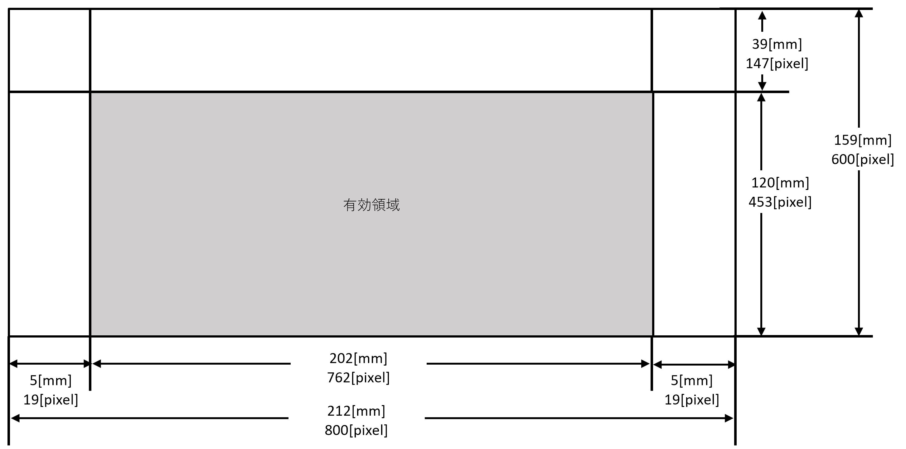 

## 図形関連

### 図形サイズのPixel指定

- 図形サイズは、図形の外接する円の直径の長さをpixel数で指定します。

### 図形上のタッチ判定領域

- 図形上のタッチ判定領域は、図形の外接する円の内側の領域としています。

### Step毎の大きさの初期設定値

- 初期設定でのStep番号に対する実際の長さを示します。

|Step|	Pixel数[pixel]	|長さ[mm]|
|:-|:-:|:-:|
|1	|80|	21.2|
|2	|120|	31.8|
|3	|160|	42.4|
|4	|200|	53.0|
|5	|250|	66.3|

:Step毎初期値

### DelayMatch時の図形間の最小距離
 - DelayMatchにおいて、2個の画像を表示します。その時、2個の図形を最低下記の距離を離して表示します。

|Pixel数[pixel]	|長さ[mm]|
|:-|:-:|
|20	|約5|

 - 詳細には、2個の図形の中心間距離を最低下記の距離以上離して配置するようにしています。
図形の中心間距離≧((図形外接円の直径／2)＊2)+図形間の最小距離

## タッチ・パネル関連

### タッチ・パネルへのタッチによるフォーカス移動現象
1. 現象
	- タッチ・パネルをタッチした場合、タッチ・パネルへフォーカスが移動し、メイン・ディスプレイのカーソルが移動してしまう現象があります。

1. 原因
	- Windowsにてマルチディスプレイ設定を使用し、タッチ・パネルをメイン・ディスプレイの拡張表示設定で使用しています。
	- Windowsの機能の為、回避できないと考えられます。
	- タッチ・パネルへはカーソルを表示しない回避策は取っています。

### メイン・ディスプレイとタッチ・パネルに表示するイメージ
- Operation画面、CheckDevice画面にて、メイン・ディスプレイのタッチ・パネル表示用画像領域へタッチ・パネルに表示されているイメージと同じイメージを表示しています。
- 詳細には、タッチ・パネルのタッチ無効領域も含んだイメージをタッチ・パネルに表示し、これと同じイメージをメイン・ディスプレイのタッチ・パネル表示用画像領域へ表示しています。
- 縦横比率が異なる為、メイン・ディスプレイに表示されるイメージが歪んだ感じに表示される事があります。

