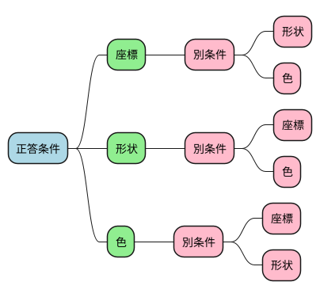

```plantuml
@startmindmap

*[#lightblue] 正答条件
**[#lightgreen] 座標
***[#FFBBCC] 別条件
****[#FFBBCC] 形状
****[#FFBBCC] 色
**[#lightgreen] 形状
***[#FFBBCC] 別条件
****[#FFBBCC] 座標
****[#FFBBCC] 色
**[#lightgreen] 色
***[#FFBBCC] 別条件
****[#FFBBCC] 座標
****[#FFBBCC] 形状
@endmindmap
```