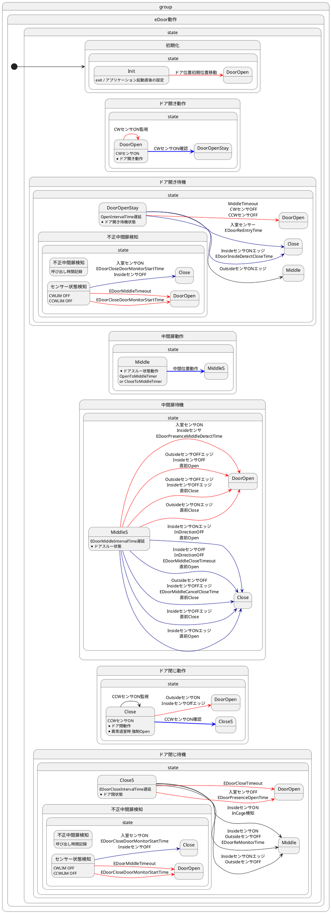

# マーモセットeDoorステートマシン  

## オペレーション遷移図 Parameter仕様

```plantuml

@startuml

left to right direction

state "eDoor動作" as group.Operation {

    [*] --> state.Init

    state "初期化" as state.Init {
        state.Init -[#red]-> state.DoorOpen : ドア位置初期位置移動
        state.Init : exit / アプリケーション起動直後の設定
    }

    state "ドア開き動作" as state.DoorOpen {
        state.DoorOpen -[#blue,bold]-> state.DoorOpenStay : CWセンサON確認
        state.DoorOpen : CWセンサON
        state.DoorOpen : * ドア開き動作
        state.DoorOpen -[#red]-> state.DoorOpen : CWセンサON監視
    }
    state "ドア開き待機" as state.DoorOpenStay {
        state.DoorOpenStay --> state.Middle : OutsideセンサONエッジ
        state.DoorOpenStay -[#darkblue]-> state.Close : InsideセンサONエッジ\n  EDoorInsideDetectCloseTime
        state.DoorOpenStay -[#darkblue]-> state.Close : 入室センサー\n EDoorReEntryTime
        state.DoorOpenStay : OpenIntervalTime遅延
        state.DoorOpenStay : * ドア開き待機状態
        state.DoorOpenStay -[#red]-> state.DoorOpen : MiddleTimeout\n CWセンサOFF\nCCWセンサOFF
        state "不正中間扉検知" as state.CheckIllegalMiddleOnOpen{
            state "不正中間扉検知" as state.CheckIllegalMiddleOnOpen : 呼び出し時間記録
            state "センサー状態検知" as state.checkDoorOnOpen : CWLIM OFF\nCCWLIM OFF
            state.checkDoorOnOpen -[#red]-> state.DoorOpen : EDoorCloseDoorMonitorStartTime
            state.checkDoorOnOpen -[#red]-> state.DoorOpen : EDoorMiddleTimeout
            state.checkDoorOnOpen -[#darkblue]-> state.Close : 入室センサON\nEDoorCloseDoorMonitorStartTime\nInsideセンサOFF
        }
    }
    state "中間扉動作" as state.Middle {
        state.Middle -[#blue,bold]-> state.MiddleS : 中間位置動作
        state.Middle : * ドアスルー状態動作
        state.Middle : OpenToMiddleTimer \nor CloseToMiddleTimer
    }
    state "中間扉待機" as state.MiddleS {
        state.MiddleS -[#darkblue]-> state.Close : InsideセンサONエッジ\n直前Open
        state.MiddleS -[#darkblue]-> state.Close : InsideセンサOFFエッジ\n直前Close
        state.MiddleS -[#darkblue]-> state.Close : OutsideセンサOFF\nInsideセンサOFFエッジ\nEDoorMiddleCancelCloseTime\n直前Close
        state.MiddleS -[#darkblue]-> state.Close : InsideセンサOFF\nInDirectionOFF\nEDoorMiddleCloseTimeout\n直前Open
        state.MiddleS -[#darkblue]-> state.Close : InsideセンサONエッジ\nInDirectionOFF\n直前Open
        state.MiddleS -[#red]-> state.DoorOpen : OutsideセンサONエッジ\n直前Close
        state.MiddleS -[#red]-> state.DoorOpen : OutsideセンサOFFエッジ\nInsideセンサOFFエッジ\n直前Close
        state.MiddleS -[#red]-> state.DoorOpen : OutsideセンサOFFエッジ\nInsideセンサOFF\n直前Open
        state.MiddleS -[#red]-> state.DoorOpen : 入室センサON\nInsideセンサ\nEDoorPresenceMiddleDetectTime
        state.MiddleS : EDoorMiddleIntervalTime遅延
        state.MiddleS : * ドアスルー状態
    }
    state "ドア閉じ動作" as state.Close {
        state.Close -[#blue,bold]-> state.CloseS : CCWセンサON確認
        state.Close : CCWセンサON
        state.Close : * ドア閉動作
        state.Close : * 異常退室時 強制Open
        state.Close --> state.Close : CCWセンサON監視
        state.Close -[#red]-> state.DoorOpen : OutsideセンサON\n InsideセンサOffエッジ
    }
    state "ドア閉じ待機" as state.CloseS {
        state.CloseS : EDoorCloseIntervalTime遅延
        state.CloseS : * ドア閉状態
        'state.CloseS --> state.CloseS : 条件監視
        state.CloseS --> state.Middle : InsideセンサONエッジ\nOutsideセンサOFF
        state.CloseS --> state.Middle : InsideセンサON\nOutsideセンサOFF\nEDoorReMonitorTime
        state.CloseS --> state.Middle : InsideセンサON\nInCage検知
        state.CloseS -[#red]-> state.DoorOpen : 入室センサOFF\nEDoorPresenceOpenTime
        state.CloseS -[#red]-> state.DoorOpen : EDoorCloseTimeout
        
        state "不正中間扉検知" as state.CheckIllegalMiddle{
            state "不正中間扉検知" as state.CheckIllegalMiddle : 呼び出し時間記録
            state "センサー状態検知" as state.checkDoor : CWLIM OFF\nCCWLIM OFF
            state.checkDoor -[#red]-> state.DoorOpen : EDoorCloseDoorMonitorStartTime
            state.checkDoor -[#red]-> state.DoorOpen : EDoorMiddleTimeout
            state.checkDoor -[#darkblue]-> state.Close : 入室センサON\nEDoorCloseDoorMonitorStartTime\nInsideセンサOFF
        }
    }
}

@enduml
```
