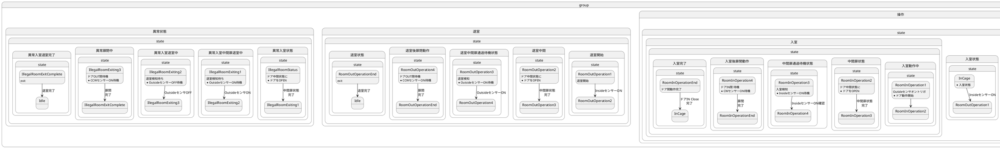

# マーモセットeDoorステートマシン  

## オペレーション状態遷移図  

```plantuml

@startuml

'left to right direction

state "操作" as group.Operation {
/'     note right of group.Operation
        = はじめに
        表示の都合上、緊急系の遷移は省略

        == 補足
        **入退室検知**
        在室センサまたは、入室、退室センサを併用することにより入退室の検知を行う機能を有すること

        = 内部で時間および応答制御されるデバイス

        = ローカルに持つもの
        - ストップウォッチ

        = 機能
        - コマンド(開始、中止、緊急停止)
        - ステート通知(ステートマシン遷移時に通知)
        - エラー通知
        - メッセージ
    endnote '/

    [*] --> state.Init

    state "初期化" as state.Init {
        state.Init --> state.Idle : ドア位置初期位置移動
        state.Init : exit / アプリケーション起動直後の設定
        state.Init : CCWセンサーON
    }

    state "アイドル" as state.Idle {
        state.Idle --> state.Sensor1On : OutsideセンサーON
        state.Idle --> state.IllegalRoomStatus : InsideセンサーON
        state.Idle: ドア退室状態
        state.Idle: CCWセンサーON
    }

    state "入室状態" as state.InCage {
        state.InCage --> state.RoomOutOperation1: InsideセンサーON
        state.InCage : *入室状態 
    }

    state "入室" as state.Sensor1On {
        state "入室動作中" as state.RoomInOperation1 {
            state.RoomInOperation1 --> state.RoomInOperation2
            state.RoomInOperation1 : Outideセンサオントリガ
            state.RoomInOperation1 : * ドア動作開始
        }

        state "中間扉状態" as state.RoomInOperation2 {
            state.RoomInOperation2 --> state.RoomInOperation3 : 中間扉状態\n完了
            state.RoomInOperation2 : ドア中間状態に
            state.RoomInOperation2 : * ドアをOPEN
        }

        state "中間扉通過待機状態" as state.RoomInOperation3 {
            state.RoomInOperation3 --> state.RoomInOperation4 : InsideセンサーON確認
            state.RoomInOperation3 : 入室検知
            state.RoomInOperation3 : * InsideセンサーON待機
        }
        state "入室後扉閉動作" as state.RoomInOperation4 {
            state.RoomInOperation4 --> state.RoomInOperationEnd : 扉閉\n完了
            state.RoomInOperation4 : ドアIN閉 待機
            state.RoomInOperation4 : * CWセンサーON待機
        }
        state "入室完了" as state.RoomInOperationEnd {
            state.RoomInOperationEnd --> state.InCage : ドアIN Close\n完了
            state.RoomInOperationEnd:ドア閉動作完了
        }
    }

    state "退室" as group.LeaveCage {
        state "退室開始" as state.RoomOutOperation1 {
            state.RoomOutOperation1 --> state.RoomOutOperation2 : InsideセンサーON
            state.RoomOutOperation1: 退室開始
        }
        state "退室中間" as state.RoomOutOperation2 {
            state.RoomOutOperation2 --> state.RoomOutOperation3 : 中間扉状態\n完了
            state.RoomOutOperation2: ドア中間状態に
            state.RoomOutOperation2: * ドアをOPEN
        }
        state "退室中間扉通過待機状態" as state.RoomOutOperation3 {
            state.RoomOutOperation3 --> state.RoomOutOperation4 : OutsideセンサーON
            state.RoomOutOperation3: 退室検知
            state.RoomOutOperation3: * OutsideセンサーON待機
        }
        state "退室後扉閉動作" as state.RoomOutOperation4 {
            state.RoomOutOperation4 --> state.RoomOutOperationEnd : 扉閉\n完了
            state.RoomOutOperation4: ドアOUT閉待機
            state.RoomOutOperation4: * CCWセンサーON待機
        }
        state "退室状態" as state.RoomOutOperationEnd {
            state.RoomOutOperationEnd --> state.Idle : 退室完了
            state.RoomOutOperationEnd: exit
        }
    }
    state "異常状態" as group.IllegalStatus{
        state "異常入室状態" as state.IllegalRoomStatus{
            state.IllegalRoomStatus --> state.IllegalRoomExiting1 : 中間扉状態\n完了
            state.IllegalRoomStatus: ドア中間状態に
            state.IllegalRoomStatus: * ドアをOPEN
        }
        state "異常入室中間扉退室中" as state.IllegalRoomExiting1{
            state.IllegalRoomExiting1 --> state.IllegalRoomExiting2 : OutsideセンサON
            state.IllegalRoomExiting1: 退室検知待ち
            state.IllegalRoomExiting1: * OutsideセンサーON待機
        }
        state "異常入室退室中" as state.IllegalRoomExiting2{
            state.IllegalRoomExiting2 --> state.IllegalRoomExiting3 : OutsideセンサOFF
            state.IllegalRoomExiting2: 退室検知待ち
            state.IllegalRoomExiting2: * OutsideセンサーOFF待機
        }
        state "異常扉閉中" as state.IllegalRoomExiting3{
            state.IllegalRoomExiting3 --> state.IllegalRoomExitComplete : 扉閉\n完了
            state.IllegalRoomExiting3: ドアOUT閉待機
            state.IllegalRoomExiting3: * CCWセンサーON待機
        }
        state "異常入室退室完了" as state.IllegalRoomExitComplete{
            state.IllegalRoomExitComplete --> state.Idle : 退室完了
            state.IllegalRoomExitComplete: exit
        }
    }

}

@enduml
```
