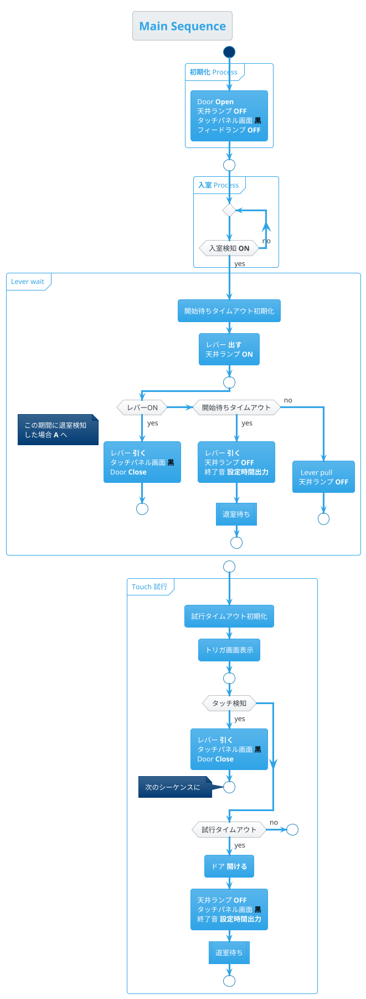

```plantuml
@startuml
!theme cerulean
title Main Sequence

start
    ':sousa|
    partition "**初期化** Process" {
    :Door **Open**
    天井ランプ **OFF**
    タッチパネル画面 **<color:Black>黒</color>**
    フィードランプ **OFF**;
    }
    (A)
    partition "**入室** Process" {
        repeat
        repeat while (入室検知 **ON**) is (no) not (yes)
    }
    partition "Lever wait" {
        note
            この期間に退室検知
            した場合 **A** へ
        endnote
        :開始待ちタイムアウト初期化;

        :レバー **出す**
        天井ランプ **ON**;
        (B)
        if (レバーON) then (yes)
            :レバー **引く**
            タッチパネル画面 **<color:Black>黒</color>**
            Door **Close**;
            (C)
            detach
        elseif (開始待ちタイムアウト) then (yes)
            :レバー **引く**
            天井ランプ **OFF**
            終了音 **設定時間出力**;
            :退室待ち|
            (A)
            detach
        else(no)
            : Lever pull
            天井ランプ **OFF**;
            (B)
            detach
        endif
    }
    (C)
    partition "Touch 試行" {


    :試行タイムアウト初期化;

    :トリガ画面表示;
    (E)
    
    if (タッチ検知) then (yes)

        :レバー **引く**
        タッチパネル画面 **<color:Black>黒</color>**
        Door **Close**;
        (D)
        note left
            次のシーケンスに
        end note

        detach

        else

    endif
    if (試行タイムアウト) then (yes)
        :ドア **開ける**;
        :天井ランプ **OFF**
        タッチパネル画面 **<color:Black>黒</color>**
        終了音 **設定時間出力**;
        :退室待ち|
        (A)
        detach
    else(no)
        (E)
        detach
    endif
    }
detach


@enduml

```