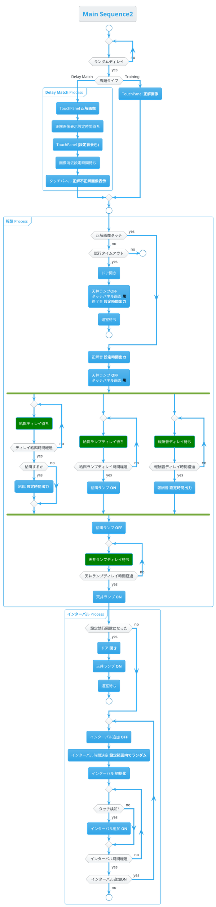

```plantuml
@startuml
!theme cerulean
title Main Sequence2
    (D)
    repeat 
    repeat while (ランダムディレイ) is (no) not (yes)
    if (課題タイプ) then (Delay Match)
    partition "**Delay Match** Process" {
        :TouchPanel **正解画像**;
        :正解画像表示設定時間待ち;
        :TouchPanel **(設定背景色)**;
        :画像消去設定時間待ち;

        :タッチパネル **正解不正解画像表示**;
    }
    else (Training)
        :TouchPanel **正解画像**;
    endif

    (E)
    partition "**報酬** Process" {
        if (正解画像タッチ) then (yes)
            
        else (no)
            if(試行タイムアウト) then (yes)
                :ドア開き;
                :天井ランプOFF
                タッチパネル画面 **<color:Black>黒</color>**
                終了音 **設定時間出力**;
                :退室待ち;
                (A)
                detach
            else (no)
                (E)
                detach
            

            endif
            
        endif
        :正解音 **設定時間出力**;
        :天井ランプ **OFF**
        タッチパネル画面 **<color:Black>黒</color>**;
        
        fork
            repeat
                #green:給餌ディレイ待ち;
            repeat while (ディレイ給餌時間経過) is (no) not (yes)
            if (給餌するか) then (yes)
                :給餌 **設定時間出力** ;
            else (no)
            endif
        fork again
            repeat
                #green:給餌ランプディレイ待ち;
            repeat while (給餌ランプディレイ時間経過) is (no) not (yes)
            :給餌ランプ **ON**;
        fork again
            repeat
                #green:報酬音ディレイ待ち;
            repeat while (報酬音ディレイ時間経過) is (no) not (yes)
            :報酬音 **設定時間出力**;

        end fork
            :給餌ランプ **OFF**;

            repeat
                #green:天井ランプディレイ待ち;
            repeat while (天井ランプディレイ時間経過) is (no) not (yes)
        :天井ランプ **ON**;
    }

    partition "**インターバル** Process" {
        if (設定試行回数になった) then (yes)
            :ドア **開き**;
            :天井ランプ **ON**;
            :退室待ち;
            (A)
            detach
        else (no)
        endif
        repeat
            :インターバル追加 **OFF**;
            :インターバル時間決定 **設定範囲内でランダム**;
            :インターバル **初期化**;
            repeat
            if (タッチ検知?) then (yes)
                :インターバル追加 **ON**;
            else (no)

            endif
            repeat while(インターバル時間経過) is (no) not (yes)
        repeat while (インターバル追加ON) is (yes) not (no)
        (B)
    }

@enduml
```