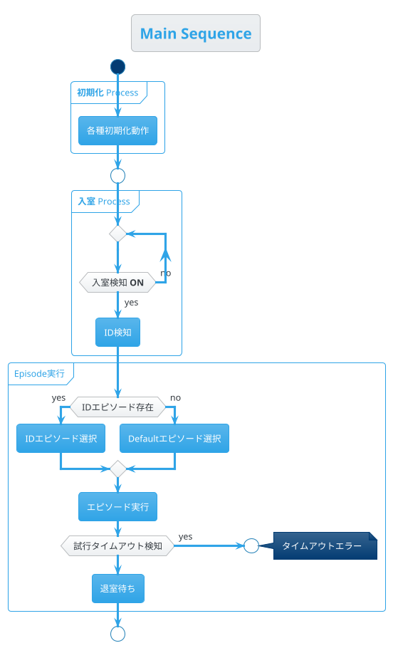

```plantuml
@startuml
!theme cerulean
title Main Sequence

start
    ':sousa|
    partition "**初期化** Process" {
    :各種初期化動作;
    }
    (A)
    partition "**入室** Process" {
        repeat
        repeat while (入室検知 **ON**) is (no) not (yes)
        :ID検知;
    }
    partition "Episode実行" {
        if (IDエピソード存在) then (yes)
            :IDエピソード選択;
        else(no)
            :Defaultエピソード選択;
        endif
        :エピソード実行;


        if (試行タイムアウト検知) then (yes)
            (D)
            note right
                タイムアウトエラー
            end note

            else
        endif
        :退室待ち;
        
    }
    (A)
    


@enduml

```