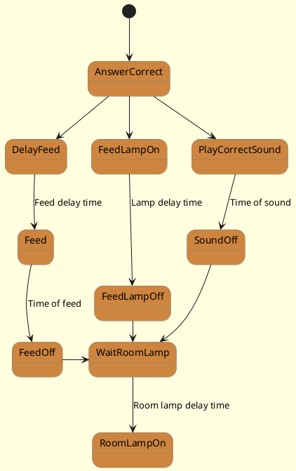

# 正答後ステート

```plantuml

@startuml

skinparam backgroundColor LightYellow
skinparam state {
  StartColor Gray
  EndColor Red
  BackgroundColor Peru
  BackgroundColor<<Warning>> Olive
  BorderColor Gray
  FontName Impact
}

[*] --> AnswerCorrect 
AnswerCorrect --> PlayCorrectSound
PlayCorrectSound --> SoundOff : Time of sound
SoundOff --> WaitRoomLamp
AnswerCorrect --> DelayFeed
AnswerCorrect --> FeedLampOn
FeedLampOn --> FeedLampOff : Lamp delay time
DelayFeed --> Feed : Feed delay time
Feed --> FeedOff : Time of feed
FeedOff -> WaitRoomLamp
FeedLampOff -> WaitRoomLamp : Feed
WaitRoomLamp --> RoomLampOn : Room lamp delay time
@enduml

```