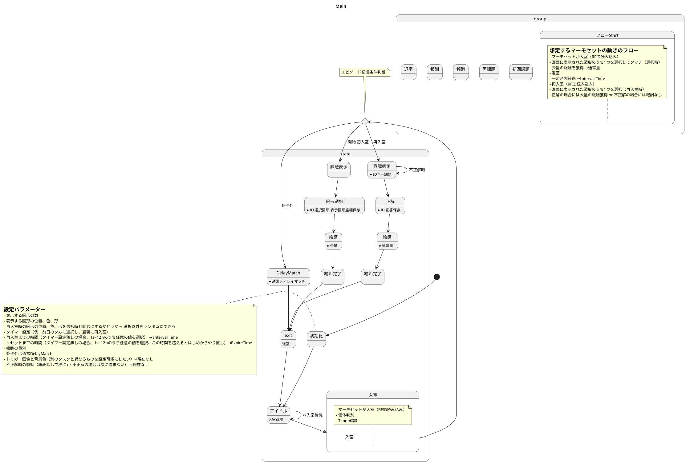

 # エピソード記憶タスクテスト
- マーモセットが選択した図形を再入室時に同じものを選ぶことで報酬がもらえる課題（マーモセットが前日に木をかじり、翌朝、樹液を吸いに戻って来る習性を利用して、エピソード記憶を評価するためのテスト）

   #  タスクのサンプルケース
        ケース1（最終ゴール）. 
        マーモセット3頭で飼育（マイクロチップID: AAA, BBB, CCC）し、タイマー設定ありの場合
        タイマー設定時間：選択16:00-19:00、再入室07:00-12:00
        1日目 07:00-16:00
        ID[AAA,BBB,CCC]が入室した場合、ディレイドマッチング課題を実施
        1日目 16:00-19:00
        ID[AAA]が入室し、エピソード課題を実施、星型の図形を選択する。
        ID[BBB]が入室し、エピソード課題を実施、四角型の図形を選択する。
        ID[AAA]が入室し、ディレイドマッチング課題を実施
        ID[CCC]が入室し、エピソード課題を実施、丸の図形を選択する。
        ID[CCC]が入室し、ディレイドマッチング課題を実施
        ２日目07:00-12:00
        ID[AAA]が入室し、エピソード課題の再入室後の工程を実施
        ID[CCC]が入室し、エピソード課題の再入室後の工程を実施
        ID[AAA]が入室し、ディレイドマッチング課題を実施
        ２日目12:00-16:00
        ID[AAA]が入室し、ディレイドマッチング課題を実施
        ID[BBB]が入室し、ディレイドマッチング課題を実施
        2日目16:00-19:00
        ID[BBB]が入室し、エピソード課題を実施、四角型の図形を選択する。
        ID[CCC]が入室し、エピソード課題を実施、丸の図形を選択する。
        ID[CCC]が入室し、ディレイドマッチング課題を実施
        3日目07:00-12:00
        ID[AAA]が入室し、ディレイドマッチング課題を実施
        ID[BBB]が入室し、エピソード課題の再入室後の工程を実施

        以下継続

        ケース2（トレーニング）. 
        マーモセット3頭で飼育（マイクロチップID: AAA, BBB, CCC）し、タイマー設定なし、再入室時間10分の場合
        9:00
        ID[AAA]が入室し、エピソード課題を実施、四角型の図形を選択する。
        9:10
        ID[AAA]が入室し、エピソード課題の再入室後の工程を実施
        9:15
        ID[AAA]が入室し、エピソード課題を実施、四角型の図形を選択する。
        9:20
        ID[BBB]が入室し、エピソード課題を実施、四角型の図形を選択する。
        9:23
        ID[AAA]が入室し、ディレイドマッチング課題を実施
        ID[CCC]が入室し、エピソード課題を実施、四角型の図形を選択する。

        9:27
        ID[AAA]が入室し、エピソード課題の再入室後の工程を実施
        12:00
        ID[BBB]が入室し、エピソード課題の再入室後の工程を実施
