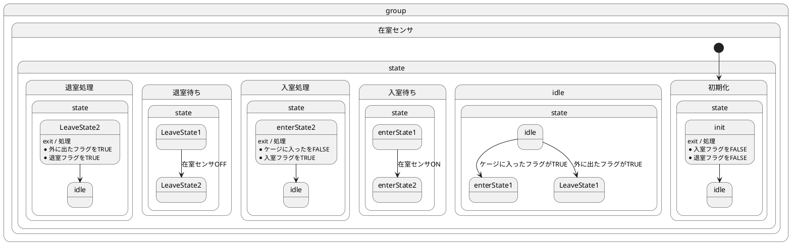

# 入室・退室・在室センサ状態遷移図

## 入室・退室状態遷移図

- 筒内で外側センサがFALSEかつはケージ側センサがFALSEの条件は起きないものとする  
- I/Oボードが割り込みを使えないため、Windowsではポーリングを行う必要がある。
  ポーリング処理は数百ms程のインターバルを持つため、マーモセットの動きがゆっくりであることが条件

```plantuml
@startuml
'left to right direction
state "入退室センサ" as group.InOutSensor {
    [*] --> state.init

    state "初期化" as state.init {
        state.init --> state.idle
        state.init : exit / 処理
        state.init : * 外に戻ったフラグをFALSE
        state.init : * ケージに入ったフラグをFALSE
    }

    state "外側またはケージに居る(idle)" as state.idle {
        state.idle --> state.inState1 : 外側センサ\n立ち上がり
        state.idle --> state.outState1 : ケージ側センサ\n立ち上がり
    }

    state "入室方向" as group.In {
        state "外に戻った処理" as state.ReturnOutSide {
            state.ReturnOutSide : exit / 外に戻ったフラグをTRUE
            state.ReturnOutSide --> state.idle
        }

        state "筒に頭" as state.inState1 {
            state.inState1 --> state.ReturnOutSide : 外側センサ\n立ち下がり
            state.inState1 --> state.inState2 : ケージ側センサ\n立ち上がり
        }

        state "ケージに頭" as state.inState2 {
            state.inState2 --> state.inState1 : ケージ側センサ\n立ち下がり
            state.inState2 --> state.inState3 : 外側センサ\n立ち下がり
        }

        state "体が外よりケージ側" as state.inState3 {
            state.inState3 --> state.inState2 : 外側センサ\n立ち上がり
            state.inState3 --> state.EnterCage : ケージ側センサ\n立ち下がり
        }

        state "ケージに入った処理" as state.EnterCage {
            state.EnterCage : exit / ケージに入ったフラグをTRUE
            state.EnterCage --> state.idle
        }
    }

    state "退室方向" as group.Out {
        state "ケージに戻った確定" as state.ReturnCage {
            state.ReturnCage : exit / ケージに戻ったフラグをTRUE
            state.ReturnCage --> state.idle
        }

        state "筒に頭" as state.outState1 {
            state.outState1 --> state.ReturnCage : ケージ側センサ\n立ち下がり
            state.outState1 --> state.outState2 : 外側センサ\n立ち上がり
        }

        state "外に頭" as state.outState2 {
            state.outState2 --> state.outState1 : 外側センサ\n立ち下がり
            state.outState2 --> state.outState3 : ケージ側センサ\n立ち下がり
        }

        state "体がケージより外側" as state.outState3 {
            state.outState3 --> state.outState2 : ケージ側センサ\n立ち上がり
            state.outState3 --> state.EnterOutSide : 外側センサ\n立ち下がり
        }

        state "外に出た処理" as state.EnterOutSide {
            state.EnterOutSide : exit / 外に出たフラグをTRUE
            state.EnterOutSide --> state.idle
        }
    }
}
@enduml
```

## 在室センサ状態遷移図

### 入室・退室センサを使う場合

