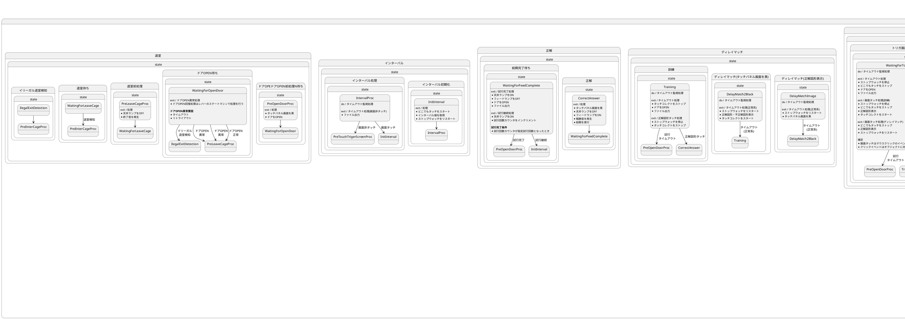

# マーモセットステートマシン  

## オペレーション状態遷移図  

```plantuml

@startuml

'left to right direction

state "操作" as group.Operation {
    note right of group.Operation
        = はじめに
        表示の都合上、緊急系の遷移は省略

        =外部で時間および応答制御されるデバイス
        出力に対して応答を制御されるデバイスは基本的に外部に処理を委託する
        **対象デバイス**
        - レバー
        - ドア
        - フィード
        - 入退室検知

        == 補足
        **入退室検知**
        在室センサまたは、入室、退室センサを併用することにより入退室の検知を行う機能を有すること

        = 内部でで時間および応答制御されるデバイス
        - フィードランプの時間の管理
        - レバーDOWNのタイムアウト
        - トリガ画面タッチのタイムアウト  

        = ローカルに持つもの
        - 画面タッチステータスラッチ
        - 試行カウンタ
        - ストップウォッチ

        = 機能
        - コマンド(開始、中止、緊急停止)
        - ステート通知(ステートマシン遷移時に通知)
        - エラー通知
        - メッセージ
    endnote

    [*] --> state.Init

    state "初期化" as state.Init {
        state.Init --> state.Idle
        state.Init : exit / アプリケーション起動直後の設定
    }

    state "アイドル" as state.Idle {
        state.Idle --> state.PreEnterCageProc : 開始
    }

    state "デバイススタンバイ" as state.DeviceStandby {
        state "デバイススタンバイ開始" as state.DeviceStandbyBegin {
            state.DeviceStandbyBegin --> state.DeviceStandby2
            state.DeviceStandbyBegin : exit / 処理
            state.DeviceStandbyBegin : * レバーをIN
            'state.DeviceStandbyBegin : * ドアをOPEN
            state.DeviceStandbyBegin : * 天井ランプをOFF
            state.DeviceStandbyBegin : * タッチパネル画面を黒
            state.DeviceStandbyBegin : * フィードランプをOFF
            state.DeviceStandbyBegin : * 入室検知フラグをFALSE
            state.DeviceStandbyBegin : * --給餌を停止--
        }

        state "デバイススタンバイ中" as state.DeviceStandby2 {
            state.DeviceStandby2 --> state.DeviceStandbyEnd : レバーIN\n完了
            state.DeviceStandby2 : * ドアをOPEN
        }

        state "デバイススタンバイ完了" as state.DeviceStandbyEnd {
            state.DeviceStandbyEnd --> state.Stop : ドアOPEN\n完了
            state.DeviceStandbyEnd --> state.PreEnterCageProc : ドアOPEN\n完了
        }
    }

    state "停止系" as group.Stop {
        state "停止" as state.Stop {
            state.Stop --> state.DeviceStandbyBegin : デバイス\nスタンバイ\n開始
            state.Stop --> state.Idle : デバイス\nスタンバイ\n完了
        }

        state "緊急停止" as stateEmergencyStop {
            stateEmergencyStop --> state.Idle
        }
    }

    state "入室" as group.EnterCage {
        state "入室前処理" as state.PreEnterCageProc {
            state.PreEnterCageProc --> state.DeviceStandbyBegin : デバイス\nスタンバイ\n開始
            state.PreEnterCageProc --> state.WaitingForEnterCage : デバイス\nスタンバイ\n完了
        }

        state "入室待ち" as state.WaitingForEnterCage {
            'state.WaitingForEnterCage --> stateEmergencyStop : 緊急停止
            'state.WaitingForEnterCage --> state.Stop : 中止

            state.WaitingForEnterCage --> state.WaitingForOutLever : 入室検知
            state.WaitingForEnterCage: exit / 入室検知処理
            state.WaitingForEnterCage: * レバーをOUT
        }

        state "レバーOUT待ち" as state.WaitingForOutLever {
            'state.WaitingForOutLever --> stateEmergencyStop : 緊急停止
            'state.WaitingForOutLever --> state.Stop : 中止

            state.WaitingForOutLever --> state.IlegalExitDetection : イリーガル\n退室検知

            state.WaitingForOutLever --> state.PreLeaveCageProc : レバーOUT\n異常
            state.WaitingForOutLever: exit / レバーOUT異常処理
            state.WaitingForOutLever: * レバーOUT回復処理はレバーのステートマシンで処理を行う

            state.WaitingForOutLever: 
            state.WaitingForOutLever --> state.WaitingForDownLever : レバーOUT\n正常
            state.WaitingForOutLever: exit / レバーOUT正常処理
            state.WaitingForOutLever: * ストップウォッチをリスタート
            state.WaitingForOutLever: 
            state.WaitingForOutLever: **レバーOUT異常要因**
            state.WaitingForOutLever: * タイムアウト
            state.WaitingForOutLever: * リトライアウト
        }

        state "レバーDOWN待ち" as state.WaitingForDownLever {
            'state.WaitingForDownLever --> stateEmergencyStop : 緊急停止
            'state.WaitingForDownLever --> state.Stop : 中止
            state.WaitingForDownLever --> state.IlegalExitDetection : イリーガル\n退室検知

            state.WaitingForDownLever : do / タイムアウト監視処理

            state.WaitingForDownLever: 
            state.WaitingForDownLever --> state.PreLeaveCageProc : レバーDOWN\nタイムアウト
            state.WaitingForDownLever : exit / タイムアウト処理
            state.WaitingForDownLever : * ストップウォッチを停止
            state.WaitingForDownLever : * レバーをIN

            state.WaitingForDownLever : 
            state.WaitingForDownLever --> state.WaitingForInLever : レバーDOWN\n(正常系)
            state.WaitingForDownLever : exit / レバーDOWN正常処理
            state.WaitingForDownLever : * ストップウォッチを停止
            state.WaitingForDownLever : * レバーをIN
        }

        state "レバーIN待ち" as state.WaitingForInLever {
            'state.WaitingForInLever --> stateEmergencyStop : 緊急停止
            'state.WaitingForInLever --> state.Stop : 中止
            state.WaitingForInLever --> state.IlegalExitDetection : イリーガル\n退室検知

            state.WaitingForInLever --> state.PreOpenDoorProc : レバーIN\n異常
            state.WaitingForInLever : exit / レバーIN異常処理
            state.WaitingForInLever : * レバーIN回復処理はレバーのステートマシンで処理を行う
            state.WaitingForInLever : * ドアをOPEN
            state.WaitingForInLever : 

            state.WaitingForInLever --> state.WaitingForCloseDoor : レバーIN\n正常
            state.WaitingForInLever : exit / レバーIN正常処理
            state.WaitingForInLever : * ドアをCLOSE
        }

        state "ドアCLOSE待ち" as state.WaitingForCloseDoor {
            'state.WaitingForCloseDoor --> stateEmergencyStop : 緊急停止
            'state.WaitingForCloseDoor --> state.Stop : 中止
            state.WaitingForCloseDoor --> state.IlegalExitDetection : イリーガル\n退室検知

            state.WaitingForCloseDoor --> state.PreLeaveCageProc : ドアCLOSE\n異常
            state.WaitingForCloseDoor : exit / ドアCLOSE異常処理
            state.WaitingForCloseDoor : * ドアCLOSE回復処理はレバーのステートマシンで処理を行う

            state.WaitingForCloseDoor : 
            state.WaitingForCloseDoor --> state.PreTouchTrigerScreenProc : ドアCLOSE\n正常
            state.WaitingForCloseDoor : exit ドアCLOSE正常処理
            state.WaitingForCloseDoor : * どこでもタッチをスタート
            state.WaitingForCloseDoor : * 試行回数カウンタをクリア
        }
    }

    state "試行" as group.Trial {
        state "トリガ画面タッチ前処理" as state.PreTouchTrigerScreenProc {
            state.PreTouchTrigerScreenProc --> state.WaitingForTouchTrigerScreen
            state.PreTouchTrigerScreenProc : exit / 処理
            state.PreTouchTrigerScreenProc : * トリガ画面表示
            state.PreTouchTrigerScreenProc : * ストップウォッチをリスタート
        }
        state "トリガ画面タッチ待ち" as state.WaitingForTouchTrigerScreen {
            'state.WaitingForTouchTrigerScreen --> stateEmergencyStop : 緊急停止
            'state.WaitingForTouchTrigerScreen --> state.Stop : 中止

            state.WaitingForTouchTrigerScreen : do / タイムアウト監視処理

            state.WaitingForTouchTrigerScreen : 
            state.WaitingForTouchTrigerScreen --> state.PreOpenDoorProc : 試行\nタイムアウト
            state.WaitingForTouchTrigerScreen : exit / タイムアウト処理
            state.WaitingForTouchTrigerScreen : * ストップウォッチを停止
            state.WaitingForTouchTrigerScreen : * どこでもタッチをストップ
            state.WaitingForTouchTrigerScreen : * ドアをOPEN
            state.WaitingForTouchTrigerScreen : * ファイル出力
            state.WaitingForTouchTrigerScreen : 

            state.WaitingForTouchTrigerScreen --> state.Training : 画面タッチ\n(訓練)
            state.WaitingForTouchTrigerScreen : exit / 画面タッチ処理(訓練)
            state.WaitingForTouchTrigerScreen : * ストップウォッチを停止
            state.WaitingForTouchTrigerScreen : * どこでもタッチをストップ
            state.WaitingForTouchTrigerScreen : * 正解図形表示
            state.WaitingForTouchTrigerScreen : * タッチコレクトをスタート

            state.WaitingForTouchTrigerScreen : 
            state.WaitingForTouchTrigerScreen --> state.DelayMatchImage : 画面タッチ\n(ディレイマッチ)
            state.WaitingForTouchTrigerScreen : exit / 画面タッチ処理(ディレイマッチ)
            state.WaitingForTouchTrigerScreen : * どこでもタッチをストップ
            state.WaitingForTouchTrigerScreen : * 正解図形表示
            state.WaitingForTouchTrigerScreen : * ストップウォッチをリスタート
            state.WaitingForTouchTrigerScreen : 
            state.WaitingForTouchTrigerScreen : 補足
            state.WaitingForTouchTrigerScreen : * 画面タッチはマウスクリックのイベントとして処理される
            state.WaitingForTouchTrigerScreen : * クリックイベントはオブジェクトに対してマウスダウンアップした際に発生する
        }

        state "ディレイマッチ" as group.DelayMatch {
            state "ディレイマッチ(正解図形表示)" as state.DelayMatchImage {
                'state.DelayMatchImage --> stateEmergencyStop : 緊急停止
                'state.DelayMatchImage --> state.Stop : 中止

                state.DelayMatchImage : do / タイムアウト監視処理

                state.DelayMatchImage : 
                state.DelayMatchImage --> state.DelayMatch2Black : タイムアウト\n(正常系)
                state.DelayMatchImage : exit / タイムアウト処理(正常系)
                state.DelayMatchImage : * ストップウォッチをリスタート
                state.DelayMatchImage : * タッチパネル画面を黒
            }

            state "ディレイマッチ(タッチパネル画面を黒)" as state.DelayMatch2Black {
                'state.DelayMatch2Black --> stateEmergencyStop : 緊急停止
                'state.DelayMatch2Black --> state.Stop : 中止

                state.DelayMatch2Black : do / タイムアウト監視処理

                state.DelayMatch2Black : 
                state.DelayMatch2Black --> state.Training : タイムアウト\n(正常系)
                state.DelayMatch2Black : exit / タイムアウト処理(正常系)
                state.DelayMatch2Black : * ストップウォッチをリスタート
                state.DelayMatch2Black : * 正解図形・不正解図形表示
                state.DelayMatch2Black : * タッチコレクトをスタート
            }

            state "訓練" as state.Training {
                'state.Training --> stateEmergencyStop : 緊急停止
                'state.Training --> state.Stop : 中止

                state.Training : do / タイムアウト監視処理

                state.Training : 
                state.Training --> state.PreOpenDoorProc : 試行\nタイムアウト
                state.Training : exit / タイムアウト処理
                state.Training : * タッチコレクトをストップ
                state.Training : * ドアをOPEN
                state.Training : * ファイル出力

                state.Training : 
                state.Training --> state.CorrectAnswer : 正解図形タッチ
                state.Training : exit / 正解図形タッチ処理
                state.Training : * ストップウォッチを停止
                state.Training : * タッチコレクトをストップ
            }
        }

        state "正解" as group.CorrectAnswer {
            state "正解" as state.CorrectAnswer {
                'state.CorrectAnswer --> stateEmergencyStop : 緊急停止
                'state.CorrectAnswer --> state.Stop : 中止

                state.CorrectAnswer --> state.WaitingForFeedComplete
                state.CorrectAnswer : exit / 処理
                state.CorrectAnswer : * タッチパネル画面を黒
                state.CorrectAnswer : * 天井ランプをOFF
                state.CorrectAnswer : * フィードランプをON
                state.CorrectAnswer : * 報酬音を再生
                state.CorrectAnswer : * 給餌を実行
            }

            state "給餌完了待ち" as state.WaitingForFeedComplete {
                'state.WaitingForFeedComplete --> stateEmergencyStop : 緊急停止
                'state.WaitingForFeedComplete --> state.Stop : 中止

                state.WaitingForFeedComplete --> state.PreOpenDoorProc : 試行完了
                state.WaitingForFeedComplete : exit / 試行完了処理
                state.WaitingForFeedComplete : * 天井ランプをON
                state.WaitingForFeedComplete : * フィードランプをOFF
                state.WaitingForFeedComplete : * ドアをOPEN
                state.WaitingForFeedComplete : * ファイル出力

                state.WaitingForFeedComplete : 
                state.WaitingForFeedComplete --> state.InitInterval : 試行継続
                state.WaitingForFeedComplete : exit / 試行継続処理
                state.WaitingForFeedComplete : * 天井ランプをON
                state.WaitingForFeedComplete : * 試行回数カウンタをインクリメント
                state.WaitingForFeedComplete : 
                state.WaitingForFeedComplete : **試行完了条件**
                state.WaitingForFeedComplete : * 試行回数カウンタが設定試行回数となったとき
            }
        }

        state "インターバル" as group.Interval {
            state "インターバル初期化" as state.InitInterval {
                'state.IntervalProc --> stateEmergencyStop : 緊急停止
                'state.IntervalProc --> state.Stop : 中止

                state.InitInterval --> state.IntervalProc
                state.InitInterval : exit / 処理
                state.InitInterval : * どこでもタッチをスタート
                state.InitInterval : * インターバル値を取得
                state.InitInterval : * ストップウォッチをリスタート
            }

            state "インターバル処理" as state.IntervalProc {
                'state.IntervalProc --> stateEmergencyStop : 緊急停止
                'state.IntervalProc --> state.Stop : 中止

                state.IntervalProc : do / タイムアウト監視処理

                state.IntervalProc : 
                state.IntervalProc --> state.PreTouchTrigerScreenProc : 画面非タッチ
                state.IntervalProc : exit / タイムアウト処理(画面非タッチ)
                state.IntervalProc : * ファイル出力

                state.IntervalProc : 
                state.IntervalProc --> state.InitInterval : 画面タッチ
            }
        }
    }

    state "退室" as group.LeaveCage {
        state "ドアOPEドアOPEN前処理N待ち" as state.PreOpenDoorProc {
            state.PreOpenDoorProc --> state.WaitingForOpenDoor
            state.PreOpenDoorProc : exit / 処理
            state.PreOpenDoorProc : * タッチパネル画面を黒
            state.PreOpenDoorProc : * ドアをOPEN
        }

        state "ドアOPEN待ち" as state.WaitingForOpenDoor {
            'state.WaitingForOpenDoor --> stateEmergencyStop : 緊急停止
            'state.WaitingForOpenDoor --> state.Stop : 中止
            state.WaitingForOpenDoor --> state.IlegalExitDetection : イリーガル\n退室検知

            state.WaitingForOpenDoor : 
            state.WaitingForOpenDoor --> state.PreLeaveCageProc : ドアOPEN\n異常
            state.WaitingForOpenDoor : exit / ドアOPEN異常処理
            state.WaitingForOpenDoor : * ドアOPEN回復処理はレバーのステートマシンで処理を行う

            state.WaitingForOpenDoor : 
            state.WaitingForOpenDoor --> state.PreLeaveCageProc : ドアOPEN\n異常
            state.WaitingForOpenDoor : **ドアOPEN異常要因**
            state.WaitingForOpenDoor : * タイムアウト
            state.WaitingForOpenDoor : * リトライアウト

            state.WaitingForOpenDoor : 
            state.WaitingForOpenDoor --> state.PreLeaveCageProc : ドアOPEN\n正常
        }

        state "退室前処理" as state.PreLeaveCageProc {
            'state.PreLeaveCageProc --> stateEmergencyStop : 緊急停止
            'state.PreLeaveCageProc --> state.Stop : 中止

            state.PreLeaveCageProc --> state.WaitingForLeaveCage
            state.PreLeaveCageProc : exit / 処理
            state.PreLeaveCageProc : * 天井ランプをOFF
            state.PreLeaveCageProc : * 終了音を再生
        }

        state "退室待ち" as state.WaitingForLeaveCage {
            'state.WaitingForLeaveCage --> stateEmergencyStop : 緊急停止
            'state.WaitingForLeaveCage --> state.Stop : 中止
            state.WaitingForLeaveCage --> state.PreEnterCageProc : 退室検知
        }

        state "イリーガル退室検知" as state.IlegalExitDetection {
            state.IlegalExitDetection --> state.PreEnterCageProc
        }
    }
}

@enduml
```
