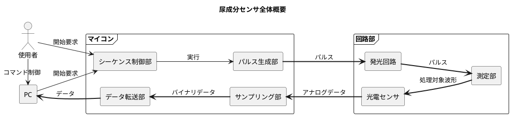
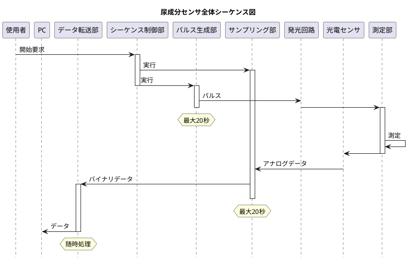
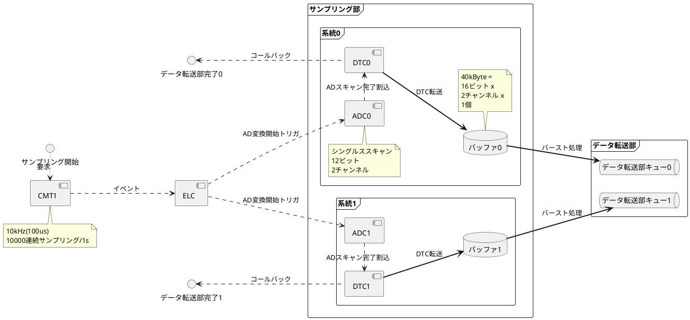
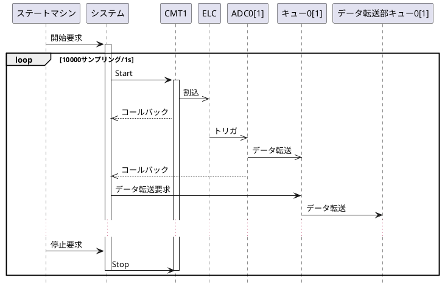
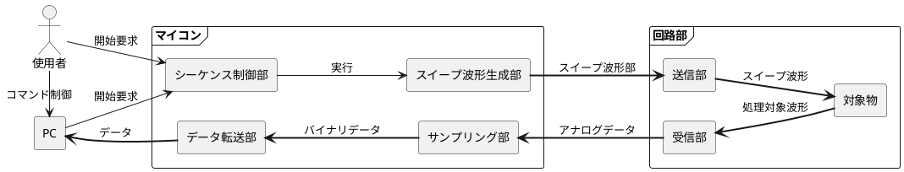
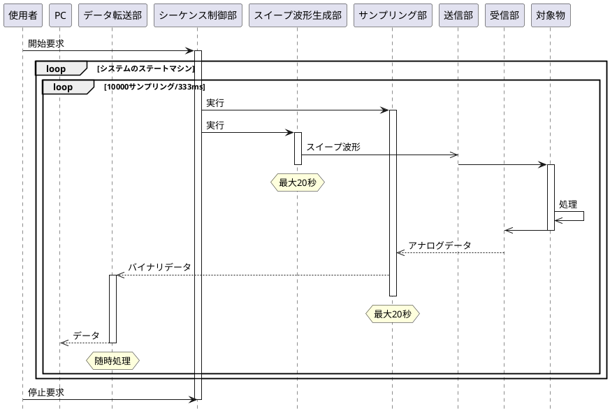
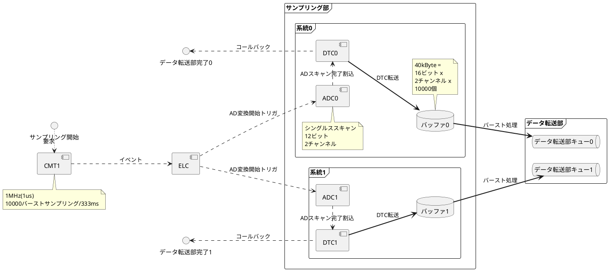
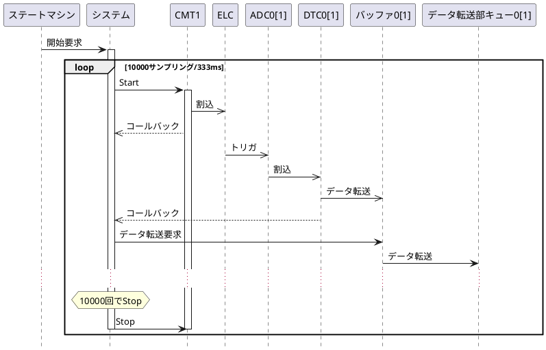
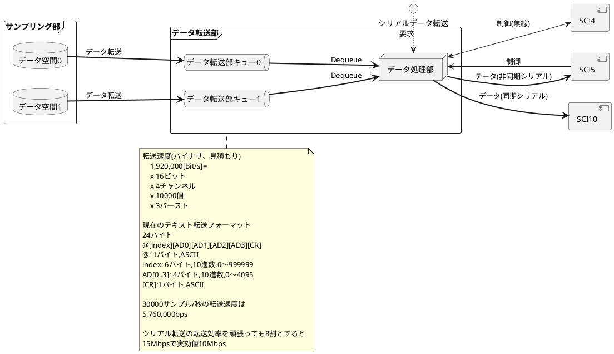

# ほげ
ほげほげ  
## ほげほげ
ほげほげ1

ほげほげ2

# はじめに
本書は LIXIL様向け RX561ベースプロジェクトの設計仕様書である。

# 尿成分センサ
## 全体
### 概要

### シーケンス図

## サンプリング部
### 概要

### シーケンス図

# 超音波センサ
## 全体
### 概要

### シーケンス図

## サンプリング部
### 概要

### シーケンス図

# データ転送部概要

# 諸設定

## SCI使用状況(開発ベース)

|SCI|bps|デバイス|用途|
|:-:|:-:|:-:|-|
|4|115200|RN42|コンソール|
|5|921600|PL2303|コンソールまたはXMODEM|
|10|7.5M|FT232H|高速シリアル通信|

## タイマ使用状況(開発ベース)

|コンポーネント|インターバル|誤差|用途|使用先|
|:-:|:-:|:-:|-|-|
|CMT0|1ms|無|同期|1s同期 333ms同期 ステートマシン(1ms)|
|CMT1|1us |有|ADC DAC|サンプリング部 波形生成|
|CMT2|100ms|無|時間制御で使う|パルス発生 サンプリング部 波形生成 |
|CMT3|10us|無|DAC (デバッグ用)|波形生成|
|TMR0|1ms|有|同期|XMODEM|
|TMR1|100us|有|同期|データ転送部|

# さいごに
