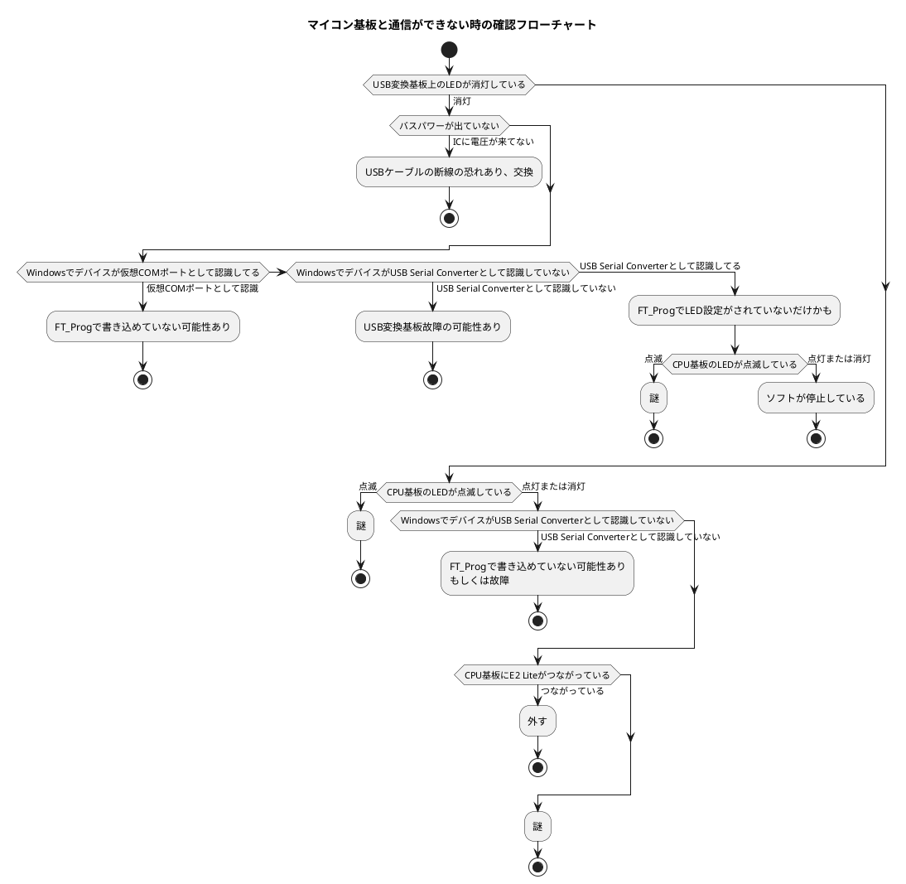

# はじめに
本資料は、尿成分センサおよび超音波センサ共通の動作確認用アプリケーションの説明書です。  

最初に共通設定を行い、各々センサ用のタブページに移行してください。  

# 共通設定
尿成分センサおよび超音波センサ共通の設定を行います。  

  

## 〔ファイル〕カテゴリの設定
**`【データ保存フォルダ】`**  
データを保存するフォルダを選択してください。  

**`【CSVファイルに保存する】`**  
CSVファイルにデータを保存するには『True』を設定します。  

## 〔スイッチの動作〕カテゴリの設定
**`【スイッチの動作】`**  
基板上に実装されているスイッチが押された時の動作を選択します。  
- 何もしない  
- 尿成分センサのデータ取得開始  
- 超音波センサのデータ取得開始  
- スイッチ動作文字列  

**`【スイッチ動作文字列】`**  
スイッチの動作で『スイッチ動作文字列』を選択した際、ここに記述した文字列がマイコンに送信されます。  

## 〔システム〕カテゴリの設定
**`【アプリのタイトル】`**  
このアプリケーションのタイトルを変更します。  

**`【完了メッセージボックスを表示】`**  
データ取得動作後、完了のメッセージボックスを表示するには『True』を設定します。  

# 尿成分センサ
各種設定を行ってからコマンド実行を開始してください。  

  

## 設定
### 〔ファイル〕カテゴリの設定
**`【EXCELファイルに保存する】`**  
EXCELファイルにデータを保存するには『True』を設定します。  

**`【PP平均値抽出＆羅列処理フォルダ】`**  
PP平均値抽出＆羅列を処理するフォルダを選択してください。  

### 〔光源電圧〕カテゴリの設定

**`【最大出力電圧値(VoutMax)】`**  
〔メニュー〕->〔光源電圧を最大値に設定〕で出力された電圧の計測値を設定します。  

**`【最小出力電圧値(VoutMin)】`**  
〔メニュー〕->〔光源電圧を最小値に設定〕で出力された電圧の計測値を設定します。  

**`【出力電圧値(Vout)】`**  
光源の出力電圧値を設定します。範囲外は最大出力電圧値または最小出力電圧値にクリップされます。  

### 〔動作〕カテゴリの設定

**`【周波数[Hz]】`**  
2Hz～2kHzの範囲で周波数[Hz]を設定してください。

**`【デューティ比[%]】`**  
1～100の範囲でデューティ比[%]を設定してください。  

**`【秒数[s]】`**  
1～20の範囲でデータの取得を行う秒数[s]を設定してください。  

## コマンド実行
  

**`【取得開始】`**  
『動作〕カテゴリで設定された値を元にマイコンからデータの取得を行います。  

**`【PP平均値抽出＆羅列処理】`**  
『PP平均値抽出＆羅列処理フォルダ』で設定した場所にあるEXCELファイルからPP平均値抽出＆羅列を行い結果のEXCELファイルの作成を行います。  

**`【光源電圧設定】`**  
『出力電圧値』に設定した値で光源電圧を出力します。  

# 超音波センサ
各種設定を行ってからコマンド実行を開始してください。  

  

## 設定
### 〔ファイル〕カテゴリの設定
**`【WAVファイルに保存する】`**  
WAVファイルにデータを保存するには『True』を設定します。  

**`【データを結合してファイルに保存する】`**  
データを結合してファイルに保存するには『True』を設定します。  

**`【AD値でファイルに保存する(デバッグで使用)】`**  
AD値でファイルに保存するには『True』を設定します。『False』を設定すると電圧値が保存されます。  

**`【オフセット電圧値[V]】`**  
ファイルに保存するAD値のオフセット電圧を設定します。  

### 〔出力波形〕カテゴリの設定
**`【波形テーブル選択】`**  
DACの波形出力に使うテーブルを選択します。  
- スイープ波形  
- 正弦波(10kHz,20kHz,30kHz,40kHz,50kHz,60kHz,70kHz,80kHz,90kHz,100kHz)  

**`【波形発生時間】`**  
DACから波形を出力する時間を選択します  
- 100us  
- 200us  
- 300us  
- 400us  
- 500us  
- 1ms  
- 2ms  

### 〔動作〕カテゴリの設定
**`【回数[Burst]】`**  
1～99の範囲でバースト回数を設定してください。  

**`【サンプリング数】`**  
サンプリング数を設定します。ファイルを分割保存する際にも使用されます。1500～20000の範囲で設定してください。  

**`【波形発生インターバル】`**  
波形を発生させるインターバルを選択します。  

**`【サンプリング周期】`**  
サンプリング周期を選択します。波形発生にも使用されます。  

## コマンド実行
  

**`【取得開始】`**  
『動作〕カテゴリで設定された値を元にマイコンからデータの取得を行います。  

# メニュー
  

**`【閉じる】`**  
アプリケーションを終了します。共通設定および各々設定の値が保存されます。
強制終了した場合は保存されません。

**`【デバイスを開く】`**  
USBシリアル変換デバイスに接続を行います。通常は自動接続されます。  

**`【デバイスを閉じる】`**  
アプリケーション起動中にUSBシリアル変換デバイスから切断を行います。  

**`【光源電圧を最大値に設定】`**  
尿成分センサの『最大出力電圧値(VoutMax)』を設定するために光源を最大電圧で出力します。  

**`【光源電圧を最小値に設定】`**  
尿成分センサの『最小出力電圧値(VoutMin)』を設定するために光源を最小電圧で出力します。  

**`【設定を直ちに保存】`**  
共通設定および各々設定の値を直ちに保存します。アプリケーション終了の際に設定値は保存されますが強制終了した場合は保存されません。

**`【動作中の解除】`**  
マイコンが固まったり通信できない等状態になった際にリセット復帰後、取得開始を行うと、実行中のメッセージボックスが表示されてしまうため、再実行できなくなります。その際に実行します。  

**`【カウンタクリア】`**  
ステータスバーに表示されているカウンタ類をクリアします。  

**`【デバッグ画面を開く】`**  
デバッグ画面を開きます。開発の際のデバッグ用につき説明は省略させて頂きます。  
  

# ステータスバー
  

**`【デバイスステータス】`**  
デバイスの接続状況を表示します。  

**`【ステートマシンステータス】`**  
マイコンの動作状況を表示します。  

**`【受信文字列数】`**  
マイコンから取得したデータ列数を表示します。  

**`【受信バイト数】`**  
マイコンから取得したデータのバイト数表示します。  

# トラブルシューティング
## マイコン基板と通信ができない
確認用のフローチャートを作成いたしました。  

以上
